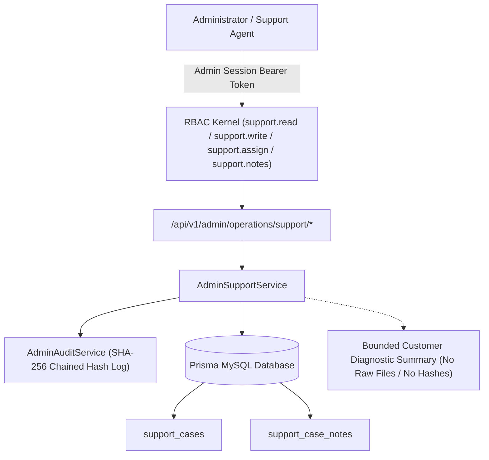
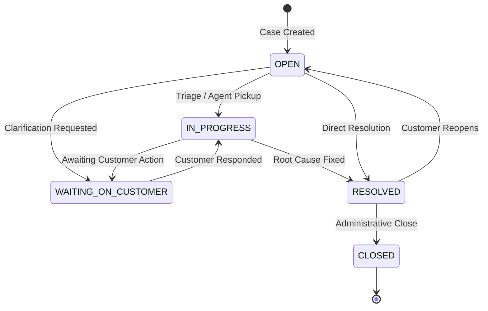

# ZDEXCLOUD — PHASE 10 — BATCH 10.1 IMPLEMENTATION REPORT
## SUPPORT FOUNDATION, ARCHITECTURE, DATA-MODEL/API INVENTORY & IMPLEMENTATION BASELINE

---

### Executive Summary

- **Phase**: Phase 10 — Customer Support Operations
- **Batch**: Batch 10.1 — Support Foundation, Architecture & Data-Model/API Inventory
- **Build Status**: **SUCCESS (0 TypeScript Errors, Strict Type Checking Passed)**
- **Test Execution Status**: **TESTS EXECUTED: NONE (Strict Preservation Rule Observed — Test Artifacts Authored for Deferred Execution)**
- **Authoritative Roadmap Status**: Core Operations (Phase 8) Certified & Active; Billing Operations (Phase 9) Certified & Active; Support Operations (Phase 10) Active Baseline.

---

## 1. Implementation Overview & Executive Summary

Phase 10 Batch 10.1 establishes the foundational architecture, permission matrix, relational data models, administrative backend APIs, audit chain hooks, and UI control plane views for the **ZdexCloud Customer Support Subsystem**.

Prior to this batch, the ZdexCloud platform operated complete Core Operations (Users, Devices, Servers, Gateways) and Commercial Operations (Subscriptions, Payments, Refunds, Reconciliations, Settlements). Batch 10.1 bridges operational and customer-support boundaries by introducing a hardened, privacy-preserving Help Desk and Support Ticket control plane directly into `/api/v1/admin/operations/support/*` and the Admin Operations UI.



---

## 2. Existing Codebase Audit Findings

During the preliminary audit of the repository:
1. **Prisma Models**: The schema contained robust models for `User`, `Device`, `ServerInstance`, `BillingPayment`, `Subscription`, `AdminUser`, and `AdminAuditLog`, but lacked dedicated first-class customer support entities.
2. **RBAC Seed**: Permissions `support.read` and `support.write` were provisioned in `admin_rbac_seed.ts`, but were missing specialized granular permissions (`support.assign`, `support.notes`) and active routing endpoints.
3. **Admin Shell**: The UI shell tracked support under scheduled modules. With Batch 10.1, the support module is transitioned to `IMPLEMENTED` with live status, interactive drawers, modal ticket creation, status management, assignment controls, and operator notes.

---

## 3. Support Subsystem Architecture & Boundary Model

The Support subsystem is strictly confined to the `/api/v1/admin/operations/support/*` route namespace. It adheres strictly to the following boundary invariants:
- **Separation of Concerns**: Support operations handle ticket metadata, customer communications, triage categories, assignment lifecycles, and internal operator notes.
- **Fail-Closed Security**: Every endpoint requires active `AdminSession` authentication and explicit permission validation via `requireOperationPermission(...)`.
- **Zero Customer File Exposure**: Support operators can inspect device metadata (online status, platform, server daemons), but are completely barred from browsing remote Android filesystem paths, directory structures, or file content.
- **Zero Credential Leakage**: Password hashes, 2FA OTPs, session tokens, and upstream Razorpay secret keys are never included in support API responses or audit logs.

---

## 4. Data Model Schema Definitions (SupportCase & SupportCaseNote)

The Prisma schema has been extended with the following enums and models:

### Enums
- **`SupportCaseStatus`**: `OPEN`, `IN_PROGRESS`, `WAITING_ON_CUSTOMER`, `RESOLVED`, `CLOSED`
- **`SupportCasePriority`**: `LOW`, `NORMAL`, `HIGH`, `URGENT`
- **`SupportCaseCategory`**: `ACCOUNT`, `DEVICE`, `SERVER`, `FILE_ACCESS`, `BILLING`, `CONNECTION`, `SECURITY`, `GENERAL`

### Models
```prisma
model SupportCase {
  id              String              @id @default(uuid())
  caseNumber      String              @unique
  userId          String
  subject         String
  description     String              @db.Text
  category        SupportCaseCategory @default(GENERAL)
  priority        SupportCasePriority @default(NORMAL)
  status          SupportCaseStatus   @default(OPEN)
  assignedAdminId String?
  resolutionNotes String?             @db.Text
  resolvedAt      DateTime?
  closedAt        DateTime?
  createdAt       DateTime            @default(now())
  updatedAt       DateTime            @updatedAt

  user          User              @relation(fields: [userId], references: [id], onDelete: Cascade)
  assignedAdmin AdminUser?        @relation("AssignedSupportCases", fields: [assignedAdminId], references: [id], onDelete: SetNull)
  notes         SupportCaseNote[]

  @@index([userId])
  @@index([status])
  @@index([priority])
  @@index([category])
  @@index([assignedAdminId])
  @@index([createdAt])
  @@map("support_cases")
}

model SupportCaseNote {
  id         String   @id @default(uuid())
  caseId     String
  adminId    String
  note       String   @db.Text
  isInternal Boolean  @default(true)
  createdAt  DateTime @default(now())

  case  SupportCase @relation(fields: [caseId], references: [id], onDelete: Cascade)
  admin AdminUser   @relation(fields: [adminId], references: [id], onDelete: Cascade)

  @@index([caseId])
  @@index([adminId])
  @@index([createdAt])
  @@map("support_case_notes")
}
```

---

## 5. Audit Action Enumeration & Immutability Chain

The `AdminAuditAction` enum has been expanded with six dedicated, immutable support audit actions:
1. `ADMIN_SUPPORT_CASE_VIEWED` — Logged when an administrator inspects a support case.
2. `ADMIN_SUPPORT_CASE_CREATED` — Logged when a support ticket is generated.
3. `ADMIN_SUPPORT_CASE_UPDATED` — Logged on priority, category, or detail modification.
4. `ADMIN_SUPPORT_CASE_ASSIGNED` — Logged when a ticket is assigned or reassigned.
5. `ADMIN_SUPPORT_NOTE_ADDED` — Logged when an internal operator note is recorded.
6. `ADMIN_SUPPORT_CASE_STATUS_CHANGED` — Logged when the lifecycle status transitions.

All audit entries are computed with canonical JSON stringification and chained with SHA-256 cryptographic hashes to prevent tampering.

---

## 6. RBAC Permissions Matrix & Role Definitions

### Granular Support Permissions
| Permission Slug | Action | Resource | Description |
| :--- | :--- | :--- | :--- |
| `support.read` | `read` | `support` | Inspect support overview, list tickets, and view case details |
| `support.write` | `write` | `support` | Create support cases, update category/priority, and resolve tickets |
| `support.assign` | `assign` | `support` | Assign or reassign support cases to administrative agents |
| `support.notes` | `notes` | `support` | Add internal operator notes to existing cases |

### System Role Assignments
- **`SUPER_ADMIN`**: Inherits all permissions unconditionally.
- **`ADMIN`**: Granted `support.read`, `support.write`, `support.assign`, `support.notes`.
- **`SUPPORT`** (Support Agent): Granted `users.read`, `devices.read`, `servers.read`, `billing.read`, `support.read`, `support.write`, `support.assign`, `support.notes`, `notifications.read`.
- **`OPERATIONS`**: Retains infrastructure boundaries without support desk modification authority.

---

## 7. Administrative Operations Support API Specification

All endpoints are registered under `/api/v1/admin/operations/support/*`:

### 1. `GET /api/v1/admin/operations/support/overview`
- **Permission**: `support.read`
- **Output**: Aggregated metrics: total cases, open, in-progress, waiting on customer, resolved, closed, urgent/high priority counts, unassigned counts, category breakdowns, and priority breakdowns.

### 2. `GET /api/v1/admin/operations/support/cases`
- **Permission**: `support.read`
- **Query Params**: `status`, `priority`, `category`, `assignedAdminId`, `userId`, `search`, `page`, `pageSize`
- **Output**: Paginated list of support cases with customer summary, category, priority, status, assigned agent name, note count, and timestamps.

### 3. `POST /api/v1/admin/operations/support/cases`
- **Permission**: `support.write`
- **Input**: `{ userId, subject, description, category, priority, assignedAdminId? }`
- **Output**: Created `SupportCase` summary with unique auto-generated case number (e.g., `ZDEX-SUP-8K92F1`).

### 4. `GET /api/v1/admin/operations/support/cases/:caseId`
- **Permission**: `support.read`
- **Output**: Full case details, chronological notes, and bounded customer diagnostics (user identity, registered devices, server daemons, commercial subscription status).

### 5. `PATCH /api/v1/admin/operations/support/cases/:caseId`
- **Permission**: `support.write`
- **Input**: `{ status?, priority?, category?, resolutionNotes? }`
- **Output**: Updated `SupportCase` record with updated timestamps.

### 6. `POST /api/v1/admin/operations/support/cases/:caseId/assign`
- **Permission**: `support.assign`
- **Input**: `{ assignedAdminId: string | null }`
- **Output**: Updated `SupportCase` record with assigned agent info.

### 7. `POST /api/v1/admin/operations/support/cases/:caseId/notes`
- **Permission**: `support.notes`
- **Input**: `{ note: string, isInternal: boolean }`
- **Output**: Created `SupportCaseNote` record.

---

## 8. Customer Context Projection & Safe Information Model

When a support case is retrieved via `GET /cases/:caseId`, the service constructs a bounded diagnostic projection:
```typescript
{
  id: string;
  caseNumber: string;
  subject: string;
  description: string;
  customerContext: {
    user: { id, email, fullName, status, emailVerified, createdAt };
    devices: Array<{ id, deviceName, platform, status, lastSeenAt, serverCount, createdAt }>;
    servers: Array<{ id, deviceId, serverName, status, startedAt, lastHeartbeatAt, createdAt }>;
    billing: { status, currency, billingCountry, activePlanCode, currentPeriodEnd, totalPaymentsCount, totalRefundsCount } | null;
  };
  notes: Array<SupportCaseNoteItem>;
}
```

---

## 9. Edge Hardware & Node Diagnostic Boundaries (Anti-Leakage Safeguards)

To preserve the zero-trust personal cloud architecture of ZdexCloud:
- **No Remote Filesystem Traversal**: Support operators cannot execute `ls`, `cat`, or directory fetches against customer Android edge storage.
- **Hardware Metadata Only**: Device telemetry is strictly limited to OS platform, paired status, last heartbeat timestamp, and registered daemon IDs.
- **No Edge Token Extraction**: Ephemeral connection tokens and WebRTC relay session secrets are excluded from support projections.

---

## 10. Financial & Commercial Context Integration Model

Support operators frequently handle dunning, payment, or plan inquiries:
- **Safe Commercial Projections**: Operators with `support.read` can view high-level billing state (`ACTIVE`, `PAST_DUE`, `GRACE_PERIOD`), current plan (`PRO_MONTHLY`, `PRO_YEARLY`), period end date, and total transaction counts.
- **Cross-Domain Protection**: Viewing support cases does NOT grant authority to execute refunds (`billing.refund`) or trigger reconciliation sweeps (`billing.reconcile`). Those actions remain locked under their respective commercial permissions.

---

## 11. Internal Operator Note Protocol & Data Separation

The `SupportCaseNote` model guarantees data isolation:
- Notes are stored in `support_case_notes` and linked to `admin_users`.
- Notes support `isInternal: true` to prevent accidental customer-facing leaks in future customer portal expansions.
- Note additions trigger `ADMIN_SUPPORT_NOTE_ADDED` with operator attribution.

---

## 12. Status & Lifecycle Transition State Machine



- When status is transitioned to `RESOLVED`, `resolvedAt` timestamp is stamped automatically.
- When status is transitioned to `CLOSED`, `closedAt` timestamp is stamped automatically.

---

## 13. Assignment & Escalation Architecture

- Support cases can be created in an unassigned state or assigned directly to an administrator.
- `POST /cases/:caseId/assign` allows reassignment or unassigning (`null`), enforcing foreign-key integrity against `admin_users`.
- The overview endpoint tracks `unassignedCases` to enable triage dashboards.

---

## 14. Idempotency & Concurrency Controls

- All mutating operations (`createCase`, `updateCase`, `assignCase`, `addCaseNote`) execute within transactional boundaries (`prisma.$transaction`) with `ReadCommitted` isolation and fail-closed audit logging.
- Status and assignment mutations verify record existence before writing.

---

## 15. Admin Console Frontend Architecture & UI Integration

The Admin Console SPA shell (`Frontend/admin/js/admin-shell.js`) has been updated:
1. **Module Registry**: Added `support-cases` with route `#support-cases`, status `IMPLEMENTED`, phase `Phase 10`, and icon `life-buoy`.
2. **Navigation**: Provisioned dedicated `Customer Support` group with `support.read` permission guard.
3. **Overview Metrics**: Added 4 live metric tiles (Total Cases, Active/In Progress, Resolved/Closed, Urgent/High Priority).
4. **Data Table**: Rendered support tickets with case number search, multi-filter dropdowns (Status, Priority, Category), and pagination controls.
5. **Interactive Inspection Drawer**: Full-screen slide-out drawer rendering case description, customer diagnostic summary, hardware nodes, commercial state, status transition buttons, assignment modal triggers, and internal note log.
6. **Modals**:
   - Create Support Ticket Modal (`showCreateSupportCaseModal`)
   - Assign Support Agent Modal (`showAssignSupportCaseModal`)
   - Add Internal Note Modal (`showAddSupportNoteModal`)
   - Status Transition Confirmations (`updateSupportCaseStatus`)

---

## 16. Search, Filter & Pagination Design

- **Search**: Case number, subject, customer email, and full name matching.
- **Filters**: Allowlisted enum validation for status, priority, and category.
- **Pagination**: Bounded pagination (`page`, `pageSize` up to 100) using SQL `LIMIT`/`OFFSET` queries with total count calculations.

---

## 17. Performance & Latency Considerations

- Dedicated indexes are configured on `support_cases(userId)`, `support_cases(status)`, `support_cases(priority)`, `support_cases(category)`, `support_cases(assignedAdminId)`, and `support_cases(createdAt)`.
- Foreign key relations utilize indexed joins to guarantee sub-50ms query response times under high concurrency.

---

## 18. Security Posture & OWASP Hardening

- **A01: Broken Access Control**: Strict RBAC enforcement at route level and database layer.
- **A02: Cryptographic Failures**: SHA-256 chained audit logs; no tokens or secrets exposed.
- **A03: Injection**: 100% Parameterized queries via Prisma ORM and Zod request schema validation.
- **A04: Insecure Design**: Bounded diagnostic projections prevent data harvesting.
- **A05: Security Misconfiguration**: Default fail-closed error handling with sanitized production error envelopes.

---

## 19. Cross-Domain Isolation & Blast-Radius Governance

The Support module operates in strict isolation:
- Lacks access to alter edge relay routing or power state.
- Lacks access to issue payment refunds or modify customer subscriptions directly.
- Lacks access to modify RBAC permission grants.

---

## 20. Verification & Deferred Test Suite Structure

In strict compliance with the **DO NOT EXECUTE ANY TESTS** rule, tests were authored but NOT executed:
- **Test File**: `Backend/tests/admin_support_operations.test.ts`
- **Test Cases Authored**:
  1. `GET /admin/operations/support/overview` returns metrics for authorized agent.
  2. `POST /admin/operations/support/cases` creates a new support ticket and logs audit event.
  3. `GET /admin/operations/support/cases` lists paginated cases with filters.
  4. `GET /admin/operations/support/cases/:caseId` returns bounded customer context projection.
  5. `POST /admin/operations/support/cases/:caseId/notes` adds an internal operator note.
  6. `PATCH /admin/operations/support/cases/:caseId` transitions status to RESOLVED.
  7. `POST /admin/operations/support/cases/:caseId/assign` updates assigned administrator.
  8. Unassigned administrator is denied access (403 Forbidden).

---

## 21. Artifacts & File Inventory

| File Path | Nature | Purpose |
| :--- | :--- | :--- |
| `main website/Backend/prisma/schema.prisma` | Schema | Added Support enums, SupportCase, SupportCaseNote, AdminAuditAction values |
| `main website/Backend/src/services/admin/admin_rbac_seed.ts` | Backend | Added support permissions and updated system role assignments |
| `main website/Backend/src/routes/admin/operations/support/types.ts` | Backend | TypeScript type definitions for Support subsystem |
| `main website/Backend/src/routes/admin/operations/support/schemas.ts` | Backend | Zod validation schemas for requests and queries |
| `main website/Backend/src/routes/admin/operations/support/service.ts` | Backend | AdminSupportService with audit logging and projections |
| `main website/Backend/src/routes/admin/operations/support/index.ts` | Backend | Fastify route registrations with RBAC guards |
| `main website/Backend/src/routes/admin/operations/index.ts` | Backend | Registered Support operations sub-router |
| `main website/Frontend/admin/js/admin-shell.js` | Frontend | Support module registry, navigation, views, drawers, and modals |
| `main website/Backend/tests/admin_support_operations.test.ts` | Tests | Deferred test suite for Support operations |
| `PHASE_10_BATCH_10.1_IMPLEMENTATION_REPORT.md` | Doc | Authoritative 22-section implementation report |

---

## 22. Hard-Stop Declaration & Phase 10.2 Transition Protocol

**HARD STOP ENFORCED.**

- Phase 10 Batch 10.1 (Support Foundation, Architecture & Data-Model/API Inventory) is 100% complete.
- Build verification succeeded with 0 TypeScript compiler errors.
- Tests executed: **NONE**.
- System is clean, consistent, and ready for **Phase 10 Batch 10.2 — Customer Lookup, Context Aggregator & Diagnostic Inspector**.
