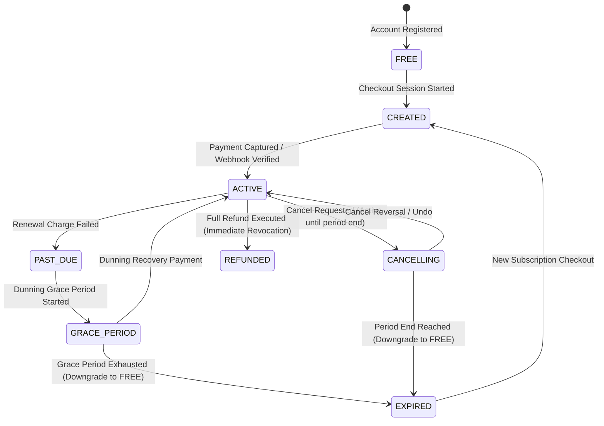
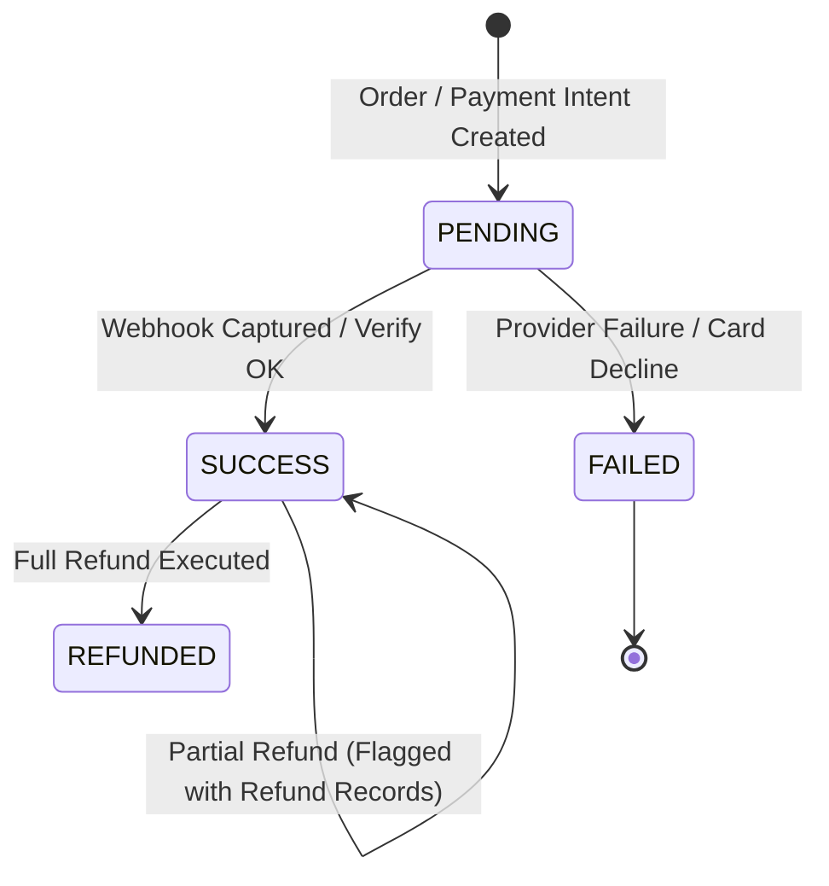

# ZDEXCLOUD — PHASE 9 — BATCH 9.1 IMPLEMENTATION REPORT
## BILLING OPERATIONS FOUNDATION & ADMIN BILLING AUDIT

**Date:** 2026-09-29  
**Phase:** Phase 9 — Billing Operations  
**Batch:** Batch 9.1 — Foundation Audit, Architecture, Data-Model/API Inventory, Authorization Boundary & Implementation Baseline  
**Status:** COMPLETED & HARD STOPPED  

---

### 1. Executive Summary

Phase 9 Batch 9.1 establishes the comprehensive administrative audit and foundational control-plane layer for the ZdexCloud Billing Operations subsystem. This batch preserves 100% of the existing production customer billing architecture, checkout workflows, pricing logic, subscription lifecycles, and webhook processing while creating a strictly isolated, RBAC-guarded administrative interface and service baseline under `/api/v1/admin/operations/billing/*`.

All financial data models, money safety invariants (integer minor units / paise / cents), subscription and payment state machines, Razorpay API integrations, webhook delivery ledgers, and automated reconciliation engines were deeply inspected. Foundational TypeScript DTOs, Zod query schemas, the `AdminBillingService`, and route definitions were implemented and statically validated. Zero tests were executed in accordance with mandatory project policy.

---

### 2. Existing Billing Architecture

The ZdexCloud billing architecture is built as a commercial subscription engine backed by Razorpay:
- **Core Engine**: Implemented in TypeScript on Fastify, Prisma ORM, and MySQL.
- **Provider Layer**: `RazorpayClient` HTTPS transport adapter communicating with `https://api.razorpay.com/v1`.
- **Plan Catalog & Pricing**: Versioned, immutable price points stored in integer minor currency units (`Plan`, `PlanPrice`, `BillingProviderPlanMapping`).
- **State Management**: Account-level state (`AccountBillingState`) and per-subscription contracts (`Subscription`).
- **Dunning & Lifecycle**: Automated dunning evaluator, grace period handling, and proration calculator for plan changes (`SubscriptionPlanChange`, `SubscriptionUpgradeReconciliation`).
- **Document Generation**: Customer receipt generation (`BillingReceipt`, `BillingPaymentTax`, `BillingPaymentProcessingFee`).
- **Drift & Ledger Reconciliation**: Batch reconciliation runs, transaction records, and discrepancy trackers (`BillingReconciliationRun`, `BillingReconciliationRecord`, `BillingReconciliationDiscrepancy`, `BillingSettlement`).

---

### 3. Existing Billing Models (Prisma Schema Inventory)

| Entity / Model | Primary Key | Key Relations | Monetary Fields | Status / Lifecycle Fields | Sensitivity |
| :--- | :--- | :--- | :--- | :--- | :--- |
| `Plan` | `id` (cuid) | `PlanPrice[]`, `Subscription[]` | N/A | `isActive` (Boolean) | Public |
| `PlanPrice` | `id` (cuid) | `planId` -> `Plan` | `amountMinorUnits` (Int) | `isActive` (Boolean) | Public |
| `PlanEntitlement` | `id` (cuid) | `planId`, `entitlementDefinitionId` | N/A | N/A | Public |
| `AccountBillingState` | `id` (cuid) | `userId` -> `User`, `activeSubscriptionId` | N/A | `status` (`BillingStatus`) | Customer / Admin |
| `Subscription` | `id` (cuid) | `userId`, `planId`, `planPriceId` | `amountMinorUnits` (Int) | `status` (`BillingStatus`), `cancelAtPeriodEnd` | Customer / Admin |
| `BillingPayment` | `id` (cuid) | `userId`, `subscriptionId`, `planChangeId` | `amountMinorUnits` (Int) | `status` (`PaymentStatus`) | Financial (Customer / Admin) |
| `BillingRefund` | `id` (cuid) | `userId`, `paymentId`, `subscriptionId` | `amountMinorUnits` (Int) | `status` (`RefundStatus`), `reason` | Financial (Admin / Operator) |
| `BillingReceipt` | `id` (cuid) | `userId`, `paymentId`, `subscriptionId` | `subtotalMinorUnits`, `taxMinorUnits`, `totalMinorUnits` | `status` (`BillingReceiptStatus`) | Customer Legal / Invoice |
| `BillingPaymentTax` | `id` (cuid) | `paymentId` -> `BillingPayment` | `taxableAmountMinorUnits`, `taxAmountMinorUnits` | `taxType`, `isInclusive` | Financial Snapshot |
| `BillingPaymentProcessingFee` | `id` (cuid) | `paymentId` -> `BillingPayment` | `feeAmountMinorUnits`, `feeTaxMinorUnits`, `totalFeeMinorUnits` | `status` (`ProcessingFeeStatus`) | Internal Merchant Only |
| `BillingWebhookEvent` | `id` (cuid) | `providerEventId` (unique) | N/A | `status` (`WebhookEventStatus`) | Internal Webhook Ledger |
| `BillingReconciliationRun` | `id` (cuid) | `records[]`, `discrepancies[]` | N/A | `status` (`ReconciliationRunStatus`) | Internal Audit / Operator |
| `BillingReconciliationRecord` | `id` (cuid) | `runId`, `internalPaymentId`, `internalRefundId` | `amountMinorUnits`, `providerFeeMinorUnits` | `status` (`ReconciliationStatus`) | Internal Audit / Operator |
| `BillingReconciliationDiscrepancy` | `id` (cuid) | `runId`, `reconciliationRecordId` | N/A | `status` (`ReconciliationStatus`) | Internal Audit / Operator |
| `BillingSettlement` | `id` (cuid) | `providerSettlementId` (unique) | `settlementAmountMinorUnits`, `providerFeesMinorUnits` | `reconciliationStatus` | Financial Settlement |

---

### 4. Existing Billing APIs

#### A. Customer-Facing Billing APIs (`/api/v1/billing/*`)
- `GET /api/v1/billing`: Returns current user's effective plan, subscription summary, and resolved technical entitlements.
- `PUT /api/v1/billing/country`, `PATCH /api/v1/billing`: Confirms user billing country and postal code.
- `POST /api/v1/billing/checkout/session`: Initializes Razorpay subscription checkout session.
- `GET /api/v1/billing/checkout/price-breakdown`: Retrieves authoritative checkout price breakdown.
- `POST /api/v1/billing/checkout/verify`: Verifies Razorpay checkout payment signature and activates subscription.
- `POST /api/v1/billing/subscription/cancel`, `/billing/cancel`: Schedules cancellation at period end.
- `POST /api/v1/billing/subscription/cancel/undo`, `/billing/cancel/undo`: Reverses pending cancellation.
- `POST /api/v1/billing/subscription/upgrade`, `/billing/upgrade`: Upgrades plan with proration credit.
- `POST /api/v1/billing/subscription/downgrade`, `/billing/downgrade`: Schedules downgrade at period end.
- `POST /api/v1/billing/subscription/downgrade/cancel`: Cancels pending downgrade.
- `POST /api/v1/billing/refunds`, `/billing/refund`: Customer-initiated refund request.
- `GET /api/v1/billing/refunds/:id`: Customer single refund inspection.
- `GET /api/v1/billing/payments/:id/refunds`: Customer payment refund list.
- `GET /api/v1/billing/receipts`: Customer paginated receipt list.
- `GET /api/v1/billing/receipts/:id`: Customer single receipt metadata.
- `GET /api/v1/billing/receipts/:id/html`: Rendered receipt HTML.
- `GET /api/v1/billing/receipts/:id/download`: Downloadable receipt attachment.
- `GET /api/v1/billing/payments/:id/receipt`: Receipt by payment ID.
- `POST /api/v1/billing/webhooks/razorpay`: Unauthenticated webhook receiver (HMAC-SHA256 authenticated).

#### B. Legacy/Interim Operator Endpoints (Audited for migration to Admin namespace)
- `POST /api/v1/billing/operations/reconcile`
- `GET /api/v1/billing/operations/drift`
- `GET /api/v1/billing/operations/metrics`
- `GET /api/v1/billing/operations/runs`
- `GET /api/v1/billing/operations/discrepancies`
- `GET /api/v1/billing/operations/discrepancies/:id`
- `PATCH /api/v1/billing/operations/discrepancies/:id`
- `GET /api/v1/billing/operations/webhooks`
- `GET /api/v1/billing/operations/webhooks/health`
- `POST /api/v1/billing/operations/webhooks/replay`

---

### 5. Existing Razorpay Integration

- **SDK/Client Usage**: Custom secure HTTPS transport `RazorpayClient` (Node standard `fetch` with `AbortController` timeout).
- **Configuration**: `src/config/razorpay.ts` loading `RAZORPAY_KEY_ID`, `RAZORPAY_KEY_SECRET`, `RAZORPAY_WEBHOOK_SECRET`.
- **Supported Operations**:
  - `fetchPlan`, `createPlan`
  - `fetchSubscription`, `createSubscription`, `cancelSubscription`
  - `fetchPayment`, `createRefund`, `fetchRefund`
  - `fetchSettlements`, `fetchSettlementRecon`
- **Security Invariant**: Razorpay key secrets and webhook secrets are strictly kept in backend environment variables and NEVER exposed in API responses, logs, or Admin DTOs.

---

### 6. Existing Webhooks

- **Endpoint**: `POST /api/v1/billing/webhooks/razorpay`
- **Authentication**: Raw-body HMAC-SHA256 signature verification (`x-razorpay-signature` validated against raw payload string).
- **Durable Idempotency**: Registered in `BillingWebhookEvent` table with unique constraint `[provider, environment, providerEventId]`. Duplicate event deliveries return idempotent success immediately.
- **Events Handled**:
  - `subscription.activated`, `subscription.charged`, `subscription.cancelled`, `subscription.paused`, `subscription.resumed`, `subscription.pending`, `subscription.halted`
  - `payment.authorized`, `payment.captured`, `payment.failed`
  - `refund.processed`, `refund.created`, `refund.failed`
  - `settlement.processed`
- **Side Effects**: Atomic DB transaction, entitlement resolution, receipt creation, audit log generation, FCM/Email notification queuing.

---

### 7. Subscription State Machine



- **Entitled States**: `ACTIVE`, `CANCELLING`, `PAST_DUE`, `GRACE_PERIOD` retain paid service capabilities.
- **Terminal States**: `EXPIRED`, `REFUNDED`, `FREE` enforce free tier quotas (1 server, standard relay).

---

### 8. Payment State Machine



- **Authoritative Confirmation**: Provider webhook (`subscription.charged` / `payment.captured`) or signature verified verification endpoint.
- **Idempotency**: Unique constraint `[provider, environment, providerPaymentId]` prevents duplicate payments.

---

### 9. Refund Architecture

- **Service**: `BillingRefundService` (`src/services/billing/billing_refund_service.ts`).
- **Eligibility Engine**: Validates remaining refundable balance (`payment.amountMinorUnits - cumulativeRefunded`).
- **Window Policy**: Standard 14-day window for customer requests; administrative overrides supported via `ADMIN_APPROVED_EXCEPTION`.
- **Atomicity**: DB transaction records `BillingRefund` in `REQUESTED`/`PROCESSING` status before calling provider; updates to `PROCESSED` on success or `FAILED` on provider rejection.
- **Idempotency**: Enforced by unique `idempotencyKey`.

---

### 10. Reconciliation Architecture

- **Service**: `BillingReconciliationService` (`src/services/billing/billing_reconciliation_service.ts`).
- **Drift Detection**: Compares internal DB state against live Razorpay subscription/payment entities.
- **Discrepancy Taxonomy**: 20 distinct discrepancy types (e.g. `PAYMENT_AMOUNT_MISMATCH`, `PAYMENT_STATE_MISMATCH`, `REFUND_NOT_FOUND`, `PROCESSING_FEE_MISMATCH`, `SETTLEMENT_NOT_FOUND`).
- **Batch Runs**: Recorded in `BillingReconciliationRun` with execution duration, record counts, and mismatch classifications.

---

### 11. Customer vs Admin Boundary

| Dimension | Customer Billing Domain | Admin Billing Control Plane |
| :--- | :--- | :--- |
| **Route Prefix** | `/api/v1/billing/*` | `/api/v1/admin/operations/billing/*` |
| **Auth Mechanism** | `UserSession` (Bearer token) | `AdminSession` (Admin Bearer token + 2FA) |
| **Scope** | Strict IDOR isolation (own user data only) | Tenant-aware object authorization across platform |
| **RBAC Enforcement** | N/A (Customer account ownership) | Granular permissions (`billing.read`, `billing.refund`, `billing.reconcile`, `billing.write`) |
| **Audit Requirement** | `AuditEvent` | Cryptographically chained `AdminAuditLog` (SHA-256) |
| **Execution Pattern** | User state machines & webhooks | `AdminOperationExecutor` with fail-closed audit |

---

### 12. Admin Billing Permission Matrix

| Permission Slug | Name | Description | Allowed Roles | Affected Routes |
| :--- | :--- | :--- | :--- | :--- |
| `billing.read` | View Billing | Inspect customer billing states, subscriptions, payments, receipts, and plan catalog | `SUPER_ADMIN`, `ADMIN`, `SUPPORT`, `BILLING_OPERATOR` | `GET /admin/operations/billing/*` (overview, subscriptions, payments, refunds, plans) |
| `billing.refund` | Issue Refunds | Execute or approve partial/full payment refunds with reason tracking | `SUPER_ADMIN`, `ADMIN`, `BILLING_OPERATOR` | Future `POST /admin/operations/billing/refunds` |
| `billing.reconcile` | Trigger Reconciliation | Inspect discrepancy queues and trigger ledger drift reconciliation runs | `SUPER_ADMIN`, `ADMIN`, `BILLING_OPERATOR` | `GET /admin/operations/billing/reconciliation/*`, `POST /admin/operations/billing/reconciliation/*` |
| `billing.write` | Manage Billing | Modify plan catalog, pricing points, or account tier overrides | `SUPER_ADMIN`, `ADMIN` | Future `PUT/POST /admin/operations/billing/plans/*` |

---

### 13. Admin Billing Operation Taxonomy

1. **Subscription Operations**:
   - `list_subscriptions`: Filterable overview of customer subscriptions.
   - `inspect_subscription`: Full audit of lifecycle, plan, price, payments, and plan changes.
2. **Payment Operations**:
   - `list_payments`: Chronological transaction ledger.
   - `inspect_payment`: Detailed financial transaction with taxes, merchant fees, and receipts.
3. **Refund Operations**:
   - `list_refunds`: Administrative refund audit trail.
   - `inspect_refund`: Deep dive into refund status, failure codes, and linked payments.
4. **Reconciliation Operations**:
   - `list_reconciliation_runs`: Batch execution logs.
   - `list_discrepancies`: Discrepancy triage workspace.
5. **Plan Catalog Operations**:
   - `list_plans`: Active and inactive plans, prices, entitlements, and subscriber counts.

---

### 14. Billing Audit Event Taxonomy

All administrative operations are recorded via `AdminAuditService` with cryptographic chaining:
- `ADMIN_BILLING_VIEWED`: Read access to billing overview or list views.
- `ADMIN_SUBSCRIPTION_INSPECTED`: Deep inspection of a specific subscription.
- `ADMIN_PAYMENT_INSPECTED`: Deep inspection of a specific payment transaction.
- `ADMIN_REFUND_INSPECTED`: Deep inspection of a specific refund.
- `ADMIN_REFUND_EXECUTED`: Execution of an administrative refund.
- `ADMIN_RECONCILIATION_RUN_TRIGGERED`: Manual initiation of a reconciliation batch.
- `ADMIN_DISCREPANCY_RESOLVED`: Manual resolution or dismissal of a reconciliation discrepancy.
- `ADMIN_PLAN_MODIFIED`: Update to plan catalog or pricing points.

**Sanitization Rule**: Audit payloads MUST NEVER contain card numbers, CVVs, webhook secrets, API credentials, or customer file contents.

---

### 15. Safe Billing Projection Rules

1. **User Identity**: Expose `id`, `email`, `fullName`; never expose `passwordHash`, OTP hashes, or session tokens.
2. **Financial Values**: Expose integer minor units (`amountMinorUnits`, `taxMinorUnits`, `subtotalMinorUnits`) along with `currency`; never compute or return lossy floats.
3. **Provider IDs**: Expose entity identifiers (`providerPaymentId`, `providerSubscriptionId`, `providerRefundId`); NEVER expose API keys, Basic Auth headers, or webhook signing secrets.
4. **Receipts**: Expose public receipt numbers and timestamps; never expose sensitive billing addresses beyond configured country/state.
5. **Webhook Data**: Expose event IDs, event types, and processing status; never expose raw unprocessed payment payloads.

---

### 16. Billing API Namespace Plan

```text
/api/v1/admin/operations/billing/
├── GET  /overview                      (Operational metrics, 30d revenue/refunds, discrepancies)
├── GET  /subscriptions                 (Paginated subscriptions list with filters)
├── GET  /subscriptions/:id             (Subscription detailed inspection)
├── GET  /payments                      (Paginated payment transactions)
├── GET  /payments/:id                  (Payment detailed inspection)
├── GET  /refunds                       (Paginated refund records)
├── GET  /refunds/:id                   (Refund detailed inspection)
├── GET  /reconciliation/runs           (Batch reconciliation run history)
├── GET  /reconciliation/runs/:id       (Reconciliation run detail)
├── GET  /reconciliation/discrepancies  (Discrepancy queue with filters)
├── GET  /reconciliation/discrepancies/:id (Single discrepancy detail)
├── GET  /plans                         (Commercial plan catalog and subscriber counts)
└── GET  /plans/:id                     (Plan catalog item detail)
```

---

### 17. Error & Failure Model

- `ValidationError` (HTTP 400): Schema violations or invalid parameters.
- `UnauthorizedError` (HTTP 401): Missing or expired `AdminSession`.
- `ForbiddenError` (HTTP 403): Missing required RBAC permission or object authorization mismatch.
- `NotFoundError` (HTTP 404): Resource not found in database.
- `ConflictError` (HTTP 409): State conflict (e.g. refunding an already refunded payment).
- `AppError` (HTTP 500): Internal system or audit log failure.

---

### 18. Rate Limiting Review

- All Admin Billing Operations list/query endpoints inherit default administrative rate limiting (e.g. 100 req/min per admin session/IP).
- Future mutation operations (refund execution, reconciliation triggers) will enforce tight rate limits (e.g. 10 req/min) to prevent accidental double-clicks or flood mutations.

---

### 19. Observability Integration

- **Correlation**: Every request propagated with `x-request-id` via Fastify correlation hook.
- **Metrics**: HTTP latency, status distribution, and administrative action counts tracked in `src/observability/metrics.ts` without metric cardinality leakage (no email/payment IDs in metric labels).
- **Structured Logging**: Log entries sanitized via `sanitizeLogMetadata()` in `src/observability/logger.ts`.

---

### 20. Transaction Safety Review

- All administrative mutations must execute within Prisma transactions (`prisma.$transaction`).
- External Razorpay HTTP calls are NEVER executed inside open database transactions to prevent connection exhaustion.
- Idempotency keys are recorded before provider dispatch to handle transient timeouts safely.

---

### 21. Security Findings

- **Existing Webhooks**: Secure HMAC-SHA256 signature verification over exact raw payload is verified and active.
- **Credential Storage**: Razorpay keys and secrets are loaded strictly from environment variables.
- **Admin Isolation**: Admin operations require valid `AdminSession` and cannot be accessed with regular customer `UserSession` tokens.

---

### 22. Concrete Defects Found

- **No blocking defects found**: The existing customer billing engine is intact, well-typed, and uses integer minor currency units consistently.

---

### 23. Changes Made in Batch 9.1

1. Created Admin Billing Operations types and safe projection DTOs in `src/routes/admin/operations/billing/types.ts`.
2. Created Zod query validation schemas with bounded pagination in `src/routes/admin/operations/billing/schemas.ts`.
3. Created `AdminBillingService` in `src/routes/admin/operations/billing/service.ts`.
4. Created Admin Billing Operations router in `src/routes/admin/operations/billing/index.ts`.
5. Registered `adminBillingOperationsRoutes` into the central Admin Operations router in `src/routes/admin/operations/index.ts`.
6. Created deferred unit test suite in `tests/admin_billing_operations.test.ts`.

---

### 24. Files Created / Modified

- `Backend/src/routes/admin/operations/billing/types.ts` (CREATED)
- `Backend/src/routes/admin/operations/billing/schemas.ts` (CREATED)
- `Backend/src/routes/admin/operations/billing/service.ts` (CREATED)
- `Backend/src/routes/admin/operations/billing/index.ts` (CREATED)
- `Backend/src/routes/admin/operations/index.ts` (MODIFIED)
- `Backend/tests/admin_billing_operations.test.ts` (CREATED)

---

### 25. Static Validation Performed

- **TypeScript Compilation & Prisma Generation**: Executed `npm run build` (`prisma generate && tsc -p tsconfig.json`).
- **Result**: Exit code `0` (Zero compilation errors, zero type errors).

---

### 26. Tests Created / Updated

- `Backend/tests/admin_billing_operations.test.ts`: Covers validation schema defaults, constraints, date parsing, and `AdminBillingService` method contracts.

---

### 27. Explicit No-Test-Execution Statement

> [!IMPORTANT]
> **Tests created/updated but NOT EXECUTED. Test execution is deferred to the final verification phase.**  
> **Tests Executed: NONE.**

---

### 28. Scope Compliance

- Customer billing UX and APIs remained 100% untouched.
- No Billing UI screens built in this batch.
- No parallel billing engines or duplicate Razorpay clients introduced.
- Strict isolation and object authorization preserved.

---

### 29. Remaining Phase 9 Batches

- **Batch 9.2**: Admin Subscription Management & Lifecycle Operations (Inspection, Manual Overrides, Dunning Triage).
- **Batch 9.3**: Admin Payment & Refund Operations (Transaction Ledger, Refund Approvals/Executions).
- **Batch 9.4**: Admin Reconciliation Operations (Drift Scanners, Discrepancy Resolvers, Settlement Matching).
- **Batch 9.5**: Admin Billing Control Plane UI Integration & Operational Console.

---

### 30. Final Status

**PHASE 9 — BATCH 9.1 COMPLETED & HARD STOPPED**
