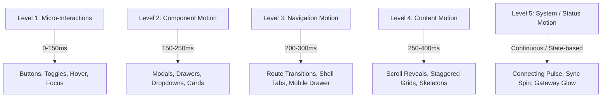

# ZDEXCLOUD — CURRENT UI/UX, RESPONSIVENESS & MOTION AUDIT
**Document ID:** `ZD-UX-0`  
**Classification:** Baseline Technical Audit & Architectural Blueprint  
**Status:** COMPLETE / PASS  
**Mode:** READ-ONLY — ZERO IMPLEMENTATION CHANGES  
**Target Codebase:** ZdexCloud Production Monorepo  
**Brand Canonical:** `ZdexCloud`  
**Android Package Identifier:** `net.remotenode.fileserver`  

---

## 1. EXECUTIVE SUMMARY

An exhaustive, read-only architectural, responsive, accessibility, visual design, and motion design audit was conducted across the three primary user-facing systems of the ZdexCloud production platform:
1. **The Main Website** (`main website/Frontend/`: 18 pages, 6 modular CSS files, 6 JS controllers)
2. **The Android Flutter Application** (`Android app/Android app code/`: 23 screens, Riverpod state management, custom core widgets)
3. **The In-built File Manager** (`main website/Frontend/file-manager-assets/` and `Android app/Android app code/In-build file managing website/`)

### Overall Findings & Current State Assessment
- **Functional Integrity is Robust:** The core control plane, device pairing, local HTTP server engine (serving on `127.0.0.1:8080`), WebSocket gateway tunneling, and file manager operations are operationally sound and logically partitioned.
- **Visual Disconnection Between Platforms:** The platform suffers from a three-way design fragmentation. The Main Website defines Slate Navy (`#0F172A`) as `--color-brand-primary` and Royal Indigo (`#2563EB`) as `--color-brand-accent`. The Android App correctly implements Royal Blue (`#2563EB`) as `primary` and Deep Slate (`#0F172A`) as `textPrimary`. The In-built File Manager defines its own disconnected set of CSS variables (`variables.css`) with different radii, font stacks (`-apple-system` instead of `Plus Jakarta Sans`), and spacing values.
- **Motion Architecture is Virtually Absent:** 
  - The Android app contains zero route transitions (defaults to generic `MaterialPageRoute`), zero animated tab transitions (raw `IndexedStack` instant swaps), and only one active `AnimationController` across the entire codebase (in `splash_screen.dart`).
  - The website features basic hover transitions (`transition: all 150ms`) but has zero enter animations, zero staggered content reveals, no coordinated skeleton-to-content cross-fades, and abrupt modal appearances (`display: flex` / `display: none`).
  - The file manager exhibits zero transition motion; modals pop in instantly, toasts have a primitive 200ms opacity transition, and folder navigation lacks spatial continuity.
- **Responsive Friction at Screen Boundaries:**
  - On the Website, the OTP verification cell group (`.otp-cells-container`) requires 352px minimum width, triggering horizontal overflow on mobile screens $\le 360\text{px}$. Breakpoint definitions are contradictory across CSS files: `layout.css` uses 820px and 1024px; `sections.css` uses 380px, 480px, 640px, 992px, and 1024px; and `file-manager.css` uses 340px, 360px, 440px, 480px, 600px, 640px, and 900px.
  - In the Android App, multiple dashboard cards and overview grids fail gracefully on compact phones ($<360\text{px}$ width) or under Android system font scaling ($>1.2\times$), causing text clipping and overflow warnings.
- **Audit Verdict:** The project possesses strong engineering bones and clean underlying logic, but requires a systematic, centralized design-and-motion overhaul to achieve the desired calm, technical, high-end SaaS aesthetic.

---

## 2. CURRENT WEBSITE ARCHITECTURE

### Directory & File Structure
```text
main website/Frontend/
├── index.html                   # Public Landing / Marketing Home
├── css/
│   ├── variables.css            # Design system tokens (9,410 bytes)
│   ├── base.css                 # CSS reset, typography base, icon styles (5,120 bytes)
│   ├── components.css           # Buttons, cards, badges, accordions, forms (18,347 bytes)
│   ├── layout.css               # Header, mobile drawer, footer, grid wrappers (10,826 bytes)
│   ├── sections.css             # Section-specific styles, hero, pricing, auth (21,908 bytes)
│   └── notification-center.css  # Notification bell popover & history styles (9,674 bytes)
├── js/
│   ├── config.js                # Environment & API host configuration
│   ├── auth.js                  # AuthService token & user storage helpers
│   ├── main.js                  # Header scroll, mobile drawer, active nav, accordion (14,841 bytes)
│   ├── server-discovery.js      # Public discovery & server lookup engine
│   ├── notification-center.js   # Notification polling, popover, badge management (37,334 bytes)
│   └── file-manager-embedded.js # Embedded bridge for file-manager.html
└── pages/                       # 17 individual subpages
```

### Architectural Observations
1. **Rendering Model:** Pure static HTML5 with Vanilla ES6 JavaScript. No client-side framework (React, Vue, etc.) is used, maximizing performance, reducing bundle size, and ensuring instant edge delivery.
2. **State & Auth Management:** Auth token (`rn_auth_token`) and user metadata (`rn_user_data`) are stored in browser `localStorage`. `main.js` and `auth.js` independently inspect these keys to toggle public vs. authenticated chrome states.
3. **Chrome & Navigation:**
   - **Header:** Sticky top header (`position: sticky; top: 0; z-index: 100`) with backdrop blur (`backdrop-filter: blur(16px)`). Adds `.is-scrolled` when `window.scrollY > 20`.
   - **Mobile Drawer:** Slide-in drawer (`transform: translateX(100%)` to `translateX(0)` with 250ms cubic-bezier transition). Implements body scroll lock (`body.drawer-open { overflow: hidden !important; }`) and ESC key listener.
   - **Footer:** Deep Slate (`#0F172A`) 5-column grid collapsing to 2 columns on tablet and 1 column on mobile.

---

## 3. CURRENT ANDROID UI ARCHITECTURE

### Directory & File Structure
```text
Android app/Android app code/lib/
├── main.dart                    # App bootstrap, ProviderScope, MaterialApp
├── core/
│   ├── config/app_config.dart   # Production endpoints & feature flags
│   ├── constants/app_constants.dart
│   ├── errors/app_error.dart
│   ├── notifications/           # Push notifications & FCM integration
│   ├── routing/app_router.dart  # Centralized route table (MaterialPageRoute)
│   ├── storage/                 # Secure token storage & device cache
│   ├── theme/                   # AppColors, AppRadius, AppSpacing, AppTypography, AppTheme
│   ├── utils/logger.dart
│   └── widgets/                 # AppButton, AppCard, AppDialog, AppHeader, AppTextField, etc.
└── features/
    ├── splash/                  # SplashScreen (Animated logo scale/fade)
    ├── auth/                    # LoginScreen, OtpScreen, AuthFoundationScreen
    ├── shell/                   # AppShell (IndexedStack with 3-item custom bottom nav)
    ├── home/                    # HomeScreen (Primary server card, storage bar, overview grid)
    ├── server/                  # ServerScreen, ServerStatusScreen (Engine toggle, local URL)
    ├── setup/                   # 7 wizard screens (Device, Config, Credentials, Review, etc.)
    ├── settings/                # SettingsScreen (Account, device info, session management)
    ├── notifications/           # NotificationCenterScreen, NotificationPreferencesScreen
    ├── help/                    # HelpScreen (Knowledge base categories)
    ├── about/                   # AboutScreen (Architecture flow diagram, version info)
    └── showcase/                # DesignSystemShowcaseScreen (Widget library visualizer)
```

### Architectural Observations
1. **State Management:** Fully reactive using `flutter_riverpod` (`StateNotifierProvider` and `AsyncNotifierProvider`).
2. **Theme Architecture:** Material 3 baseline configured in `app_theme.dart`. Strongly decoupled token classes (`AppColors`, `AppRadius`, `AppSpacing`, `AppTypography`).
3. **Navigation & Shell:**
   - `AppRouter` uses standard `MaterialPageRoute`. All transitions are native Android platform defaults (slide from right or fade-through).
   - `AppShell` employs `IndexedStack` to persist tab states across `HomeScreen`, `ServerScreen`, and `SettingsScreen`. Switching tabs is instantaneous without cross-fade or slide animation.
4. **Protected Integration:** Native Android service interaction (`MainActivity.kt`, foreground server notification service, battery optimization handlers) is isolated behind clean repository contracts.

---

## 4. EXISTING DESIGN SYSTEM

### Cross-Platform Token Alignment Matrix

| Token Category | Specification / Prompt Guideline | Website Implementation | Android Flutter Implementation | File Manager Implementation | Alignment Status |
| :--- | :--- | :--- | :--- | :--- | :--- |
| **Brand Primary** | `#2563EB` (Royal Blue) | `--color-brand-primary: #0F172A`<br>*(#2563EB set as `--color-brand-accent`)* | `AppColors.primary = Color(0xFF2563EB)` | `--color-brand-primary: #2563EB` | **MISALIGNED** (Website inverted primary vs accent) |
| **Brand Hover** | `#1D4ED8` | `--color-brand-accent-hover: #1D4ED8` | `AppColors.primaryHover = Color(0xFF1D4ED8)` | `--color-brand-primary-hover: #1D4ED8` | **ALIGNED** |
| **Soft Blue** | `#EFF6FF` | `--color-brand-accent-subtle: #EFF6FF` | `AppColors.primarySubtle = Color(0xFFEFF6FF)` | `--color-brand-light: #EFF6FF` | **ALIGNED** |
| **Deep Slate** | `#0F172A` | `--color-text-primary: #0F172A` | `AppColors.textPrimary = Color(0xFF0F172A)` | `--color-text-primary: #0F172A` | **ALIGNED** |
| **Canvas** | `#FAFAFC` | `--color-bg-page: #F8FAFC`<br>*(Off by slight tint)* | `AppColors.background = Color(0xFFFAFAFC)` | `--color-bg-body: #FAFAFC` | **MINOR VARIANCE** |
| **Surface** | `#FFFFFF` | `--color-bg-surface: #FFFFFF` | `AppColors.surface = Color(0xFFFFFFFF)` | `--color-bg-surface: #FFFFFF` | **ALIGNED** |
| **Secondary Text**| `#334155` | `--color-text-secondary: #334155` | `AppColors.textSecondary = Color(0xFF334155)` | `--color-text-secondary: #475569`<br>*(Uses Slate 600)* | **INCONSISTENT** |
| **Muted Text** | `#64748B` | `--color-text-muted: #64748B` | `AppColors.textMuted = Color(0xFF64748B)` | `--color-text-muted: #94A3B8`<br>*(Uses Slate 400)* | **INCONSISTENT** |
| **Border** | `#E2E8F0` | `--color-border: #E2E8F0` | `AppColors.borderSubtle = Color(0xFFE2E8F0)` | `--color-border-subtle: #E2E8F0` | **ALIGNED** |
| **Focus** | `#2563EB` | `--color-border-focus: #2563EB` | `AppColors.borderFocused = Color(0xFF2563EB)` | Handled via outline | **ALIGNED** |
| **Status Online** | `#059669` / `#ECFDF5` | `--color-status-online: #059669`<br>`--color-status-online-bg: #ECFDF5` | `AppColors.statusOnline = Color(0xFF059669)`<br>`AppColors.statusOnlineBg = Color(0xFFECFDF5)` | `--color-status-online: #059669`<br>`--color-status-online-bg: #ECFDF5` | **ALIGNED** |
| **Status Connecting**| `#D97706` / `#FFFBEB` | `--color-status-connecting: #D97706`<br>`--color-status-connecting-bg: #FFFBEB` | `AppColors.statusConnecting = Color(0xFFD97706)`<br>`AppColors.statusConnectingBg = Color(0xFFFFFBEB)` | `--color-status-warning: #D97706`<br>`--color-status-warning-bg: #FFFBEB` | **ALIGNED** |
| **Status Offline** | `#64748B` / `#F1F5F9` | `--color-status-offline: #64748B`<br>`--color-status-offline-bg: #F1F5F9` | `AppColors.statusOffline = Color(0xFF64748B)`<br>`AppColors.statusOfflineBg = Color(0xFFF1F5F9)` | Not defined | **PARTIALLY ALIGNED** |
| **Status Error** | `#DC2626` / `#FEF2F2` | `--color-status-error: #DC2626`<br>`--color-status-error-bg: #FEF2F2` | `AppColors.statusError = Color(0xFFDC2626)`<br>`AppColors.statusErrorBg = Color(0xFFFEF2F2)` | `--color-status-error: #DC2626`<br>`--color-status-error-bg: #FEF2F2` | **ALIGNED** |
| **Typography Sans**| Plus Jakarta Sans | Google Fonts import: `Plus Jakarta Sans` | `AppTypography.fontFamily = 'Plus Jakarta Sans'` | `-apple-system, BlinkMacSystemFont...` | **MISALIGNED** (File Manager lacks font) |
| **Typography Mono**| JetBrains Mono | Google Fonts import: `JetBrains Mono` | `AppTypography.monoFontFamily = 'JetBrains Mono'` | `ui-monospace, SFMono-Regular...` | **MISALIGNED** (File Manager lacks font) |
| **Border Radii** | 8, 12, 16, 24, 9999 | 4, 8, 12, 16, 20, 24, 9999px | 4, 8, 12, 999dp (`AppRadius`) | 4, 6, 8, 12, 16, 9999px | **FRAGMENTED** across platforms |
| **Icon System** | Lucide SVG (No Emojis) | Inline SVG Lucide specification (2px stroke) | Flutter Material Icons (`Icons.*`) | Inline SVG Lucide specification | **INCONSISTENT** (Material Icons on Android) |
| **Min Touch Target**| 44 × 44 pt/px | `min-height: 44px` on `.btn`, `.form-input` | `AppConstants.minTouchTargetSize = 44.0` | `min-height: 44px` on interactive targets | **ALIGNED** |

---

## 5. WEBSITE PAGE INVENTORY

A total of 18 distinct HTML documents were inspected across the main website frontend:

| # | Page File | Route / Purpose | Header / Nav Type | Major Components | Responsive Layout Pattern | Key Deficiencies Identified |
| :- | :--- | :--- | :--- | :--- | :--- | :--- |
| 1 | `index.html` | Homepage / Marketing Landing | Public Sticky Header | Hero, Feature Grid, Architecture Diagram, FAQ Accordion, Final CTA, Footer | 2-Col Grid $\to$ 1-Col Stack; Auto-fit feature cards | Hardcoded gradient overlays; visual diagrams lack smooth animated interaction |
| 2 | `pages/product.html` | Product Overview & Specs | Public Sticky Header | Product breakdown, Tech specs, Local vs Cloud comparison table | 2-Col Grid $\to$ 1-Col Stack; Responsive tables | Comparison table requires horizontal scroll on mobile; dense typography |
| 3 | `pages/how-it-works.html`| Architecture & Workflow | Public Sticky Header | Step-by-step connection flow, Socket diagrams, Security callout | Vertical Step cards with step numbers | Step connecting lines break on smaller screens |
| 4 | `pages/documentation.html`| Documentation & Guides | Public Sticky Header | Sidebar topic index, Content markdown cards, Code blocks | 2-Col (300px sidebar + content) $\to$ 1-Col | Sidebar does not fold into an off-canvas drawer on mobile |
| 5 | `pages/pricing.html` | Pricing & Tier Comparison | Public Sticky Header | 3 Pricing cards, Feature matrix table, FAQ accordion | 3-Col Grid $\to$ 1-Col; Overflow table | **Content Contradiction:** Cards say 5 phones, table says 1 phone |
| 6 | `pages/about.html` | Mission & Architecture | Public Sticky Header | Core principles, Team statement, System diagram | Centered narrow container + 2-col cards | Plain static appearance; lacks technical polish |
| 7 | `pages/contact.html` | Support & Inquiries | Public Sticky Header | Contact form, Support channels card, Response expectation | 2-Col Split $\to$ 1-Col Stack | Form inputs lack floating labels or validation feedback animations |
| 8 | `pages/faq.html` | Frequently Asked Questions | Public Sticky Header | Search filter, Accordion panels, Support CTA | Centered narrow container (max 800px) | Accordion expand/collapse lacks smooth height animation |
| 9 | `pages/login.html` | Platform Sign In | Public Sticky Header | 2-Panel Split (Brand showcase + Login card), Social login | Split 50/50 $\to$ 1-Col stacked card | Raw JavaScript `alert()` on Google login button; no input shake on error |
| 10 | `pages/get-started.html` | Account Registration | Public Sticky Header | 2-Panel Split (Feature list + Sign up form) | Split 50/50 $\to$ 1-Col stacked card | Same split layout as login; lacks password strength meter animation |
| 11 | `pages/verify-otp.html` | 6-Digit OTP Verification | Public Sticky Header | 6 Individual digit inputs, Resend timer, Status alert | Centered card on canvas | **Overflow Bug:** Cell row width (352px) causes scroll on 320px screens |
| 12 | `pages/forgot-password.html`| Password Reset Flow | Public Sticky Header | Step 1 (Email) & Step 2 (Reset Code) forms | Centered auth card | Transitions between steps rely on raw `display: none` without slide |
| 13 | `pages/dashboard.html` | Control Plane Dashboard | Authenticated Header | 4 Stat cards, Privacy callout, Server instance grid, Skeletons | 4-Col stats $\to$ 2-Col $\to$ 1-Col; 3-Col servers | Abrupt card popping on 10s auto-refresh; heavy inline CSS throughout |
| 14 | `pages/server-access.html`| Remote Server Discovery | Authenticated Header | Email lookup form, Server status list, Direct connect CTA | Centered search card + Result list | No skeleton loading state during remote lookup; instant text swap |
| 15 | `pages/notifications.html` | Web Notification Center | Authenticated Header | Unread counter, Category filters, History feed, Preferences | 2-Col (2fr 1fr) $\to$ Uncontrolled on mobile | **Layout Break:** 2fr 1fr grid has no breakpoint in CSS, crushing on mobile |
| 16 | `pages/file-manager.html`| Embedded Remote File Browser| Custom Minimal Bar | Sidebar nav, Category grid, File table, Upload modal, Lightbox | Sidebar + Main Pane $\to$ Bottom Nav | Different CSS variables loaded; overrides SVG sizes with `!important` |
| 17 | `pages/privacy.html` | Privacy Policy | Public Sticky Header | Standard legal document typography, Anchored sections | Single-column narrow reading layout | Clean, but lacks floating table-of-contents navigation |
| 18 | `pages/terms.html` | Terms of Service | Public Sticky Header | Standard legal document typography, Anchored sections | Single-column narrow reading layout | Clean text layout, minor line-height readability issues |

---

## 6. ANDROID SCREEN INVENTORY

A total of 23 screens and presentations were audited across the Flutter application:

| # | Screen Class | Feature / Path | App Bar / Header | Layout Container | Navigation Triggers | Key Deficiencies Identified |
| :- | :--- | :--- | :--- | :--- | :--- | :--- |
| 1 | `SplashScreen` | `splash/presentation/` | None (Full-screen dark) | Centered Column with `AnimatedBuilder` | Auto-navigates to `/home` or `/login` | Fixed 1200ms timer can collide with session restore; hardcoded slate bg |
| 2 | `LoginScreen` | `auth/presentation/` | Minimal (Body Safe Area) | `SingleChildScrollView` + `Form` | Navigates to `/auth/otp` on success | No animated shake on validation error; static link button to website |
| 3 | `OtpScreen` | `auth/presentation/` | Minimal (Body Safe Area) | `SingleChildScrollView` + `Form` | Navigates to `/home` on success | Single text input instead of segmented 6-cell visual boxes |
| 4 | `AuthFoundationScreen` | `auth/presentation/` | None | Scaffold with error banner | Router fallback | Boilerplate foundation wrapper; unused in primary journey |
| 5 | `AppShell` | `shell/presentation/` | Delegated to active child | `Scaffold` with `IndexedStack` | Bottom Nav (Home, Server, Settings) | No cross-fade between tabs; bottom indicator duration hardcoded 200ms |
| 6 | `HomeScreen` | `home/presentation/` | `AppHeader` (Sync action) | `SingleChildScrollView` (max 640dp) | Primary Action: Setup or Manage | 2x2 grid (`Row` with `Expanded`) breaks on $<360\text{dp}$ screens |
| 7 | `ServerScreen` | `server/presentation/` | `AppHeader` | `SingleChildScrollView` (max 640dp) | Primary Action: Setup or Status | Duplicate setup logic; abrupt card switch between configured/unconfigured |
| 8 | `ServerStatusScreen` | `server/presentation/` | `AppHeader` (Back button) | `SingleChildScrollView` | Start, Stop, Restart server buttons | **Component Violation:** Uses inline `AlertDialog` instead of `AppDialog` |
| 9 | `SetupFoundationScreen`| `setup/presentation/` | `AppHeader` | Scaffold body | Flow coordinator | Redundant abstraction layer; empty shell |
| 10 | `SetupDeviceScreen` | `setup/presentation/` | `AppHeader` | `SingleChildScrollView` | Next $\to$ Configuration | Stepper does not animate step transition; radio options lack micro-motion |
| 11 | `SetupConfigurationScreen`| `setup/presentation/`| `AppHeader` | `SingleChildScrollView` | Next $\to$ Credentials | Port field validation is basic; no smooth keyboard avoid padding |
| 12 | `SetupCredentialsScreen`| `setup/presentation/`| `AppHeader` | `SingleChildScrollView` | Next $\to$ Review | Password field visibility toggle lacks smooth icon transition |
| 13 | `SetupReviewScreen` | `setup/presentation/` | `AppHeader` | `SingleChildScrollView` | Next $\to$ Creating | Plain key-value list; lacks summary visual hierarchy |
| 14 | `SetupCreatingScreen` | `setup/presentation/` | `AppHeader` | `SingleChildScrollView` | Auto-navigates to Success/Failure | Text changes abruptly through 6 stages without fade or progress bar |
| 15 | `SetupSuccessScreen` | `setup/presentation/` | `AppHeader` | `SingleChildScrollView` | Navigates to `/home` | Static checkmark; lacks celebratory entrance animation |
| 16 | `SetupFailureScreen` | `setup/presentation/` | `AppHeader` | `SingleChildScrollView` | Retry setup | Static error icon; lacks guided troubleshooting accordion |
| 17 | `SettingsScreen` | `settings/presentation/`| `AppHeader` | `SingleChildScrollView` | Sign Out, Manage Nodes, Privacy | Long scrolling list without sticky category anchors; plain cards |
| 18 | `NotificationCenterScreen`| `notifications/screens/`| `AppHeader` (Read All) | `Column` with horizontal chips + list | Tap item $\to$ View details | Choice chips have standard Material highlight; list item removal is instant |
| 19 | `NotificationPreferencesScreen`| `notifications/screens/`| `AppHeader` (Back button)| `ListView` | Toggle channels | Switches lack custom brand styling; plain Material switches |
| 20 | `HelpScreen` | `help/presentation/` | `AppHeader` (Back button) | `SingleChildScrollView` | Tap category $\to$ Website docs | List cards have no press elevation or chevron translation |
| 21 | `AboutScreen` | `about/presentation/` | `AppHeader` (Back button) | `SingleChildScrollView` | External links | Architecture step diagram is static text without pulse or data flow |
| 22 | `DesignSystemShowcaseScreen`| `showcase/presentation/`| `AppHeader` (Back button)| `SingleChildScrollView` | Interactive widgets preview | Great internal tool; reveals lack of motion tokens in base system |
| 23 | `SetupStepper` (Widget)| `setup/presentation/` | Embedded Widget | Dynamic `Row` or `Column` | Step indicator | Jump cuts between compact progress bar and wide step row at 380dp |

---

## 7. RESPONSIVE AUDIT ACROSS BREAKPOINTS

### Evaluation Matrix

| Viewport Width | Device Category Example | Website Behavior | Android App Behavior | File Manager Behavior |
| :---: | :---: | :--- | :--- | :--- |
| **320px** | iPhone SE (1st gen), small watch-phones | **BROKEN:** OTP cells overflow (352px width). Header action buttons squish logo. | **MARGINAL:** 2x2 grid causes text wrap on "Device Model" / "Local Port". | **BROKEN:** Category grid (min 80px) overflows container; header squished. |
| **360px** | Galaxy S8/S9/S10, standard small Android | **MARGINAL:** OTP cells barely fit if padding is 0. Mobile drawer covers 85vw. | **PASS:** Standard layout works, but long server names truncate aggressively. | **MARGINAL:** Bottom navigation bar icons touch screen edges. |
| **375px** | iPhone 12/13 mini, iPhone SE (2nd/3rd gen) | **PASS:** Marketing sections stack cleanly; mobile drawer functions smoothly. | **PASS:** Baseline target width. UI renders without severe clipping. | **PASS:** File list table collapses to card-like item row. |
| **390px** | iPhone 14/15/16 Pro | **PASS:** Comfortable margins; Plus Jakarta Sans typography renders sharp. | **PASS:** Native layout looks balanced; button targets exceed 48dp. | **PASS:** Search input and filter button layout properly. |
| **414px** | iPhone Plus / Max series | **PASS:** Optimal mobile viewing experience for marketing and dashboard. | **PASS:** Ample spacing; generous padding around cards. | **PASS:** Storage distribution bar displays all segment labels cleanly. |
| **480px** | Large Android phablets, landscape small phones| **INCONSISTENCY:** `sections.css` applies `@media (max-width: 480px)` overrides. | **PASS:** Stepper wide-row layout activates cleanly. | **PASS:** 2-column category grid renders cleanly. |
| **768px** | iPad Mini, small tablets portrait | **WEAKNESS:** Marketing grids switch to 2-column; excessive whitespace in hero. | **PASS:** `maxContentWidth: 640dp` prevents awkward stretching. | **WEAKNESS:** Sidebar is hidden but bottom bar looks stretched. |
| **834px** | iPad Air / Pro 11" portrait | **GAP:** `layout.css` triggers mobile nav at 820px; 834px shows desktop nav with cramped links. | **PASS:** Constrained box centers content gracefully. | **PASS:** Desktop sidebar appears (`min-width: 768px` threshold). |
| **1024px** | iPad Pro 12.9", small laptops | **PASS:** Desktop nav visible; footer grid displays 2-columns (`@media 1024px`). | **PASS:** (Foldable/Tablet mode) Content centered with elegant margins. | **PASS:** Full 4-column storage stat cards and complete file table visible. |
| **1280px** | Standard HD laptops | **OPTIMAL:** Layout container reaches `max-width: 1200px`; all grids aligned. | N/A (Desktop/Web view only) | **OPTIMAL:** Side-by-side storage distribution and breadcrumb tree. |
| **1440px** | MacBook Pro 16", QHD monitors | **OPTIMAL:** Generous canvas margins; crisp typography hierarchy. | N/A | **OPTIMAL:** Smooth scrolling in file table with fixed headers. |
| **1920px+** | 4K / Ultrawide desktop displays | **WEAKNESS:** Hero radial background looks clipped; fixed max-width creates huge empty gutters. | N/A | **WEAKNESS:** File list rows become excessively long; scanning eye fatigue. |

---

## 8. WEBSITE RESPONSIVE ISSUES

1. **Contradictory & Fragmented Media Query Breakpoints:**
   - `layout.css` uses `@media (max-width: 1024px)` and `@media (max-width: 820px)` for header collapse.
   - `sections.css` uses `@media (max-width: 1024px)`, `@media (max-width: 992px)`, `@media (max-width: 640px)`, `@media (max-width: 480px)`, and `@media (max-width: 380px)`.
   - `file-manager.css` uses `@media (max-width: 900px)`, `@media (max-width: 640px)`, `@media (max-width: 600px)`, `@media (max-width: 480px)`, `@media (max-width: 440px)`, `@media (max-width: 360px)`, and `@media (max-width: 340px)`.
   - *Impact:* Elements pop and break at random intervals between 600px and 992px, creating inconsistent responsive behaviors across pages.
2. **OTP 6-Cell Group Overflow on 320px–360px:**
   - In `verify-otp.html`, `.otp-cell-input` has a fixed width of `52px` and height of `60px`, with `gap: var(--space-xs)` (8px).
   - Total width: $(6 \times 52) + (5 \times 8) = 352\text{px}$. On a 320px screen or a 360px screen with 16px padding (328px usable), this forces horizontal scrolling or crops the final digit.
3. **Notification Center Grid Collapse Failure:**
   - In `notifications.html`, the container uses inline `style="grid-template-columns: 2fr 1fr; gap: 32px;"`.
   - On screens $<768\text{px}$, this inline style is never reset by media queries, compressing the right preference pane to $<100\text{px}$ width.
4. **Pricing Comparison Matrix Table Overflow:**
   - The table in `pricing.html` has 4 columns and relies on `.pricing-table-wrapper { overflow-x: auto; }`.
   - On mobile, the first column ("Feature / Capability") scrolls out of view, making it impossible to read what feature corresponds to which tier. A sticky first column is missing.
5. **Dashboard Stat Grid Compression:**
   - In `dashboard.html`, `.dashboard-stat-grid` displays 4 cards. Between 768px and 850px, the values ("TLS 1.3 Active") overflow their cards and wrap into broken two-line strings.
6. **Documentation Sidebar Lack of Mobile Off-Canvas:**
   - On `documentation.html`, the documentation topic list simply stacks vertically above the content, forcing users to scroll past 40 links before reaching the actual guide.

---

## 9. ANDROID RESPONSIVE ISSUES

1. **Infrastructure Overview 2x2 Grid Overflow on Small Phones:**
   - In `home_screen.dart` (lines 304–342), the "Device Model" and "Local Port" overview uses `Row(children: [Expanded(child: AppCard(...)), Expanded(...)])`.
   - On 320dp–340dp screens (or with larger accessibility font sizes), the internal text `"Android Phone - Physical Storage Host"` clips or throws layout overflow warnings.
2. **Stepper Abrupt Layout Shift at 380dp:**
   - In `setup_stepper.dart`, a hardcoded condition `final isCompact = screenWidth < 380;` switches between an entirely different vertical progress bar and horizontal numbered circle row.
   - Rotating a small device from portrait (360dp) to landscape (640dp) causes a jarring visual jump without animation.
3. **Raw `AlertDialog` Usage Bypassing Screen Insets:**
   - In `server_status_screen.dart`, start/stop actions construct inline `AlertDialog` widgets with hardcoded padding, ignoring `AppDialog` standards and clipping buttons on small screens.
4. **Lack of Text Scaling Support (Accessibility Spcaling $>1.3\times$):**
   - Multiple cards use fixed container heights (e.g. `SizedBox(height: 60)` in bottom nav) that clip labels when Android TalkBack / Accessibility Text Scaling is enabled.

---

## 10. COMPONENT AUDIT MATRIX

| Component | Current Implementation | Consistency Score | Responsive Quality | Motion Opportunity | Redesign Priority |
| :--- | :--- | :---: | :---: | :--- | :---: |
| **Buttons** | `.btn`, `.btn-primary`, `.btn-secondary`, `PrimaryButton`, `SecondaryButton` | **HIGH** | **HIGH** (Meets 44px min target) | Add active scale (`0.98`), hover elevation, icon slide on hover | **MEDIUM** |
| **Inputs** | `.form-input`, `AppTextField` | **MEDIUM** | **HIGH** | Floating label animation, focus ring glow, error shake | **HIGH** |
| **Cards** | `.card`, `.card-hover`, `AppCard` | **HIGH** | **HIGH** | Subtle lift (`translateY(-2px)`), enter fade-in, border glow | **MEDIUM** |
| **Badges / Pills** | `.badge`, `.badge-accent`, `StatusBadge` | **HIGH** | **HIGH** | Status dot pulse, smooth background color transition on change | **LOW** |
| **Alerts / Banners** | `.alert`, `ErrorMessageBanner` | **MEDIUM** | **MEDIUM** | Slide-down reveal, dismissal slide-and-fade | **MEDIUM** |
| **Dialogs / Modals** | `.modal`, `.modal-overlay`, `AppDialog` | **POOR** (Inconsistent implementations) | **MEDIUM** | Backdrop blur fade, modal scale-in from 0.95 to 1.0 | **CRITICAL** |
| **Navigation Chrome**| `.site-header`, `.mobile-nav-drawer`, `AppShell` | **MEDIUM** | **MEDIUM** | Header scroll contraction, drawer smooth bezier slide, tab cross-fade | **CRITICAL** |
| **Tabs** | `.tab-btn`, `IndexedStack` (Flutter) | **POOR** | **MEDIUM** | Sliding indicator pill under active tab, content fade | **HIGH** |
| **Tables** | `.pricing-table`, File Manager table | **LOW** | **POOR** (No sticky first col) | Row hover highlight, sort indicator rotation | **HIGH** |
| **Empty States** | Embedded HTML empty cards, `EmptyState` widget | **HIGH** | **HIGH** | Gentle icon floating motion, staggered action appearance | **MEDIUM** |
| **Skeletons** | `.skeleton`, `SkeletonLoader` | **MEDIUM** | **HIGH** | Synchronized shimmer wave, cross-fade to loaded content | **HIGH** |
| **Toasts** | `.toast`, `ScaffoldMessenger` SnackBar | **LOW** | **HIGH** | Spring slide-up from bottom, progress auto-dismiss bar | **MEDIUM** |
| **Status Indicators**| `.status-indicator`, `StatusBadge` | **HIGH** | **HIGH** | Smooth SVG color interpolation, animated connecting pulse | **HIGH** |
| **File Items** | `.file-card`, `.file-row` (File Manager) | **MEDIUM** | **MEDIUM** | File icon hover tilt, selection checkbox pop, context menu slide | **HIGH** |
| **Device / Server Cards**| `.card card-hover`, `AppCard` in Home/Server | **HIGH** | **MEDIUM** | Live status morphing, online glow halo, storage bar fill on load | **HIGH** |

---

## 11. MOTION AUDIT & CLASSIFICATION

Motion must serve a clear cognitive purpose: communicating hierarchy, spatial continuity, feedback, and system status. It must never feel gratuitous, slow, or template-like.

### Motion Classification by Hierarchy Tier



### Actionable Animation Candidate Catalog

| Area / Element | Motion Tier | Proposed Behavior | Candidate Rating | Justification |
| :--- | :--- | :--- | :---: | :--- |
| **Button Press** | Level 1 | Micro-scale down to 0.98 on press, restore on release | **MUST HAVE** | Immediate tactile feedback; establishes premium SaaS responsiveness |
| **Card Hover** | Level 1 | `translateY(-2px)` + shadow elevation 8px $\to$ 16px | **MUST HAVE** | Affords clickability and focus without layout displacement |
| **Toggle Switches** | Level 1 | Thumb translation with spring easing (150ms) | **MUST HAVE** | Eliminates abrupt state jumps in settings |
| **Icon Hover / Action**| Level 1 | 2°–4° subtle tilt or 2px directional nudge | **SHOULD HAVE**| Playful yet disciplined engineering feel |
| **Modal Dialogs** | Level 2 | Scale 0.96 $\to$ 1.0 + Opacity 0 $\to$ 1 (200ms enter curve) | **MUST HAVE** | Eliminates current jarring pop-in across file manager & web |
| **Bottom Sheet** | Level 2 | Slide up from bottom with decelerated enter curve | **MUST HAVE** | Standard mobile spatial metaphor |
| **Toast Notifications**| Level 2 | Spring slide from bottom-right + progress timeout line | **MUST HAVE** | Informs user without breaking workflow; currently primitive 200ms opacity |
| **Accordion Panels** | Level 2 | Smooth grid height expansion (`grid-template-rows: 0fr` to `1fr`) | **MUST HAVE** | Fixes current instant display snap on FAQ & Docs |
| **Mobile Drawer** | Level 3 | Slide-in from right with cubic bezier (250ms) | **MUST HAVE** | Preserves spatial navigation context |
| **Shell Tab Switch** | Level 3 | Subtle horizontal slide (12px) + fade cross-fade (180ms) | **MUST HAVE** | Replaces jarring `IndexedStack` instant swap in Flutter |
| **Route Transitions**| Level 3 | Shared axis (X or Z) transition (250ms) | **MUST HAVE** | Unifies Android screen flow with calm SaaS precision |
| **Scroll Section Reveal**| Level 4 | Subtle translateY(16px) $\to$ 0 + fade on viewport enter | **SHOULD HAVE**| Creates calm, structured reading rhythm on marketing pages |
| **Staggered Card Grid**| Level 4 | Cards appear sequentially with 40ms stagger offset | **SHOULD HAVE**| Directs eye flow from primary to secondary items |
| **Skeleton Cross-Fade**| Level 4 | Shimmer pulse $\to$ cross-fade to loaded content (200ms) | **MUST HAVE** | Prevents layout flashing on dashboard 10s auto-refresh |
| **Connecting Status Pulse**| Level 5 | Breathing amber halo (scale 1.0 $\to$ 1.25, opacity 0.8 $\to$ 0.2) | **MUST HAVE** | Visually distinguishes connecting from offline states |
| **Gateway Sync Spin** | Level 5 | Single 360° smooth rotation on manual refresh trigger | **MUST HAVE** | Instant acknowledgment that backend sync is active |
| **Server Online Halo** | Level 5 | Single soft green ping on initial transition to ONLINE | **SHOULD HAVE**| Confirms successful gateway handshake |
| **Hero Parallax** | Level 4 | Continuous multi-layer scroll tracking | **DO NOT ANIMATE**| High battery drain, layout recalculation risk, distraction |
| **Complex SVG Path Morphs**| Level 4| Infinite morphing blobs in background | **DO NOT ANIMATE**| Detracts from technical credibility; harms 60fps budget |
| **Text Letter Scramble**| Level 1 | Cyberpunk-style letter randomization | **DO NOT ANIMATE**| Gimmicky, childish, impairs accessibility |

---

## 12. SCROLL EXPERIENCE AUDIT

### Opportunities for Intentional Motion
1. **Sticky Header Elevation Morph:**
   - As the user scrolls past 20px, the header background transitions from `rgba(255, 255, 255, 0.86)` to `rgba(255, 255, 255, 0.96)`, adding a refined 1px border (`#E2E8F0`) and ambient shadow (`0 4px 12px -2px rgba(15, 23, 42, 0.05)`).
   - This communicates surface elevation without jumping.
2. **Intersection-Observer Staggered Reveals:**
   - Replace static page dumping with `IntersectionObserver` observing major sections (`#hero`, `#product`, `#architecture`, `#pricing`).
   - Content items slide up $16\text{px}$ and fade in over $300\text{ms}$ with `cubic-bezier(0.16, 1, 0.3, 1)`.
3. **What NOT to Animate on Scroll:**
   - No heavy parallax backgrounds.
   - No scroll-jacking or artificial momentum scroll physics.
   - No pinned sections that trap mousewheel gestures.

---

## 13. NAVIGATION ANIMATION OPPORTUNITIES

1. **Android Bottom Navigation Active Indicator:**
   - In `AppShell`, when moving between "Home", "Server", and "Settings", the active pill container (`AppColors.primarySubtle`) should slide smoothly between tabs rather than re-instantiating.
2. **Route Transition Standardization:**
   - In `app_router.dart`, replace `MaterialPageRoute` with a custom `ZdexPageRoute` implementing a refined 250ms horizontal slide and fade with fast deceleration (`Curves.easeOutCubic`).
3. **Web Active Link Sliding Underline:**
   - In `layout.css`, the active nav indicator (`.nav-link.is-active::after`) currently pops instantly. A CSS view transition or animated transform will give the header navigation unified continuity.

---

## 14. INTERACTION ANIMATION OPPORTUNITIES

1. **Password Visibility Toggle:**
   - In both Web (`login.html`, `get-started.html`) and Android (`login_screen.dart`, `setup_credentials_screen.dart`), the eye / eye-off icon should cross-fade and scale smoothly rather than snapping.
2. **Copy to Clipboard Feedback:**
   - When copying server URLs or device IDs, the copy icon should morph to a checkmark for 1500ms before reverting, accompanied by a subtle green badge flash.
3. **Form Error Input Shake:**
   - When submitting invalid forms, the offending input field should execute a restrained 3-cycle horizontal shake ($\pm 4\text{px}$ over $250\text{ms}$) to immediately guide visual attention.

---

## 15. LOADING & SKELETON MOTION OPPORTUNITIES

1. **Unified Shimmer Gradient:**
   - Website `.skeleton` and Flutter `SkeletonLoader` must share an identical gradient: Slate 100 (`#F1F5F9`) base with Slate 200 (`#E2E8F0`) shimmer highlight running at 1.5s linear infinite.
2. **Smooth Cross-Fade on Data Arrival:**
   - In `dashboard.html` and `HomeScreen`, when `isFetching` completes, the skeleton cards must fade to opacity 0 while the live server cards fade to opacity 1 over 180ms, eliminating the current visual snap.

---

## 16. SERVER/DEVICE STATUS MOTION OPPORTUNITIES

1. **The Pulse Dot Indicator:**
   - Online dot: Static emerald `#059669` with a subtle static ambient ring (`box-shadow: 0 0 0 2px rgba(5, 150, 105, 0.2)`).
   - Connecting / Reconnecting dot: Animated breathing ring scaling from $1.0\times$ to $1.6\times$ and fading out over $1.5\text{s}$ infinite loop.
   - Offline dot: Neutral slate `#64748B`, zero animation.
   - Error dot: Soft red `#DC2626`, zero continuous animation (avoid alarming flashing).

---

## 17. FILE MANAGER MOTION OPPORTUNITIES

1. **Breadcrumb Drill-Down:**
   - Clicking a folder should slide the file list left by $20\text{px}$ as it fades out, while the new directory contents slide in from the right ($+20\text{px} \to 0$) over 180ms.
2. **Upload Progress Bar:**
   - File upload progress indicators must use smooth hardware-accelerated `transform: scaleX(...)` rather than layout-triggering `width: X%`.
3. **Media Lightbox Modal:**
   - Photos and videos should scale up from the clicked thumbnail position into center view with backdrop blur fade-in over 220ms.

---

## 18. ACCESSIBILITY AUDIT (WCAG 2.2 AA)

### Web Accessibility Findings
- **Focus Rings:** Excellent baseline in `base.css` (`:focus-visible { outline: 2px solid var(--color-border-focus); outline-offset: 3px; box-shadow: 0 0 0 4px rgba(37, 99, 235, 0.15); }`).
- **Contrast Ratios:**
  - High contrast on headings (`#0F172A` on `#FFFFFF` = 15.4:1 — Exceeds AAA).
  - Secondary text (`#334155` on `#FFFFFF` = 9.7:1 — Exceeds AAA).
  - Muted text (`#64748B` on `#FFFFFF` = 4.7:1 — Passes AA).
  - Subtle text (`#94A3B8` on `#FFFFFF` = 2.6:1 — **Fails AA for body text**, permissible only for disabled placeholder states).
- **Reduced Motion Support:**
  - Robust `@media (prefers-reduced-motion: reduce)` block in `base.css` overriding animations to `0.01ms !important`.
  - However, inline styles and certain JS timers in `notification-center.js` and `main.js` bypass this media query.

### Android Accessibility Findings
- **Touch Targets:** All buttons in `core/widgets/` respect `AppConstants.minTouchTargetSize = 44.0`.
- **TalkBack Semantics:** Missing `Semantics(label: ...)` annotations on custom icon buttons (e.g. sync refresh button in `AppHeader`, password toggle buttons in text fields).
- **Reduced Motion:** The Flutter app currently does not check `MediaQuery.of(context).disableAnimations`. Future animation controllers must check this flag.

---

## 19. PERFORMANCE AUDIT (60FPS INVARIANTS)

1. **Layout Thrashing Risks in Current Code:**
   - In `file-manager.js`, dynamic DOM insertion creates multiple sequential layout recalculations when rendering large directories (100+ files).
   - In `dashboard.html`, `renderSkeletonLoaders()` and `loadUserServers()` replace `innerHTML` directly on a 10s timer, re-parsing the entire DOM tree.
2. **Animation Property Invariants:**
   - **Allowed Properties for Continuous / Micro Motion:** `transform` (translate, scale, rotate) and `opacity`.
   - **Strictly Prohibited Properties for Motion:** `width`, `height`, `margin`, `padding`, `top`, `left`, `right`, `bottom`, `max-height`.
3. **Flutter Rebuild Optimization:**
   - In `home_screen.dart`, large widget trees inside `SingleChildScrollView` lack `const` constructors on static cards, forcing entire screen repaints during setup state updates.
   - Must introduce `RepaintBoundary` around animated status indicators and progress bars to prevent rebuilding static infrastructure cards.

---

## 20. DESIGN SYSTEM GAPS

1. **Missing Unified Brand Tokens:** No single source of truth across Web, Android, and File Manager.
2. **Missing Centralized Motion Tokens:** Neither CSS nor Flutter defines standardized motion tokens for duration, easing, or distance.
3. **Missing Reusable Web Component Classes:** `dashboard.html`, `server-access.html`, and `file-manager.html` rely heavily on inline `style="..."` attributes instead of reusable utility classes.
4. **Disjointed File Manager Styling:** The File Manager maintains duplicate CSS files in `file-manager-assets/css/` that deviate from `Frontend/css/`.

---

## 21. RECOMMENDED MOTION TOKENS

To prevent arbitrary animation durations, all future batches must strictly use these centralized tokens:

### Duration Tokens
- `motion-duration-instant`: **100ms** (Micro-feedback, button active states, icon morphs)
- `motion-duration-fast`: **150ms** (Toggles, checkboxes, tooltips, dropdowns)
- `motion-duration-normal`: **250ms** (Cards, dialogs, drawers, route transitions)
- `motion-duration-slow`: **350ms** (Full page transitions, complex expansions)
- `motion-duration-emphasis`: **500ms** (Celebratory states, status banners)

### Easing Tokens
- `motion-easing-standard`: `cubic-bezier(0.2, 0, 0, 1)` (General movement, continuous transitions)
- `motion-easing-enter`: `cubic-bezier(0, 0, 0.2, 1)` (Decelerated curve for entering elements)
- `motion-easing-exit`: `cubic-bezier(0.4, 0, 1, 1)` (Accelerated curve for exiting elements)
- `motion-easing-spring`: `cubic-bezier(0.34, 1.56, 0.64, 1)` (Subtle tactile bounce on micro-interactions)

### Motion Distance Tokens
- `motion-distance-sm`: **4px** (Hover lifts, button active states, badge pops)
- `motion-distance-md`: **12px** (Dropdown entries, notification toasts, tab slides)
- `motion-distance-lg`: **24px** (Modal scale/slide, drawer entrances, page transitions)

---

## 22. RECOMMENDED RESPONSIVE BREAKPOINTS

A single, unified 6-point responsive scale must replace all existing conflicting media queries:

```css
/* Canonical ZdexCloud Breakpoint System */
--breakpoint-xs: 480px;   /* Mobile Landscape & Phablets */
--breakpoint-sm: 640px;   /* Large Phones / Mini Tablets */
--breakpoint-md: 768px;   /* Tablets Portrait */
--breakpoint-lg: 1024px;  /* Tablets Landscape / Small Laptops */
--breakpoint-xl: 1280px;  /* Standard Desktop */
--breakpoint-2xl: 1536px; /* Ultrawide & High-Res Displays */
```

---

## 23. RECOMMENDED COMPONENT ARCHITECTURE

### Web Architecture Standard
- Consolidate `main website/Frontend/file-manager-assets/css/` into `main website/Frontend/css/`. Eliminate redundant `variables.css`.
- Eliminate inline `style="..."` attributes on `dashboard.html`, `login.html`, and `file-manager.html`. Replace with clean, semantic utility classes.
- Standardize modal controllers into a single accessible `ModalController` handling focus trapping, ESC key, scroll locking, and enter/exit animation states.

### Android Architecture Standard
- Enforce strict usage of `AppDialog` across all screens. Eliminate inline `AlertDialog` in `server_status_screen.dart`.
- Introduce `ZdexMotion` token class in `core/theme/app_motion.dart`.
- Implement `ZdexPageRoute` for consistent, smooth route transitions throughout `AppRouter`.

---

## 24. RECOMMENDED IMPLEMENTATION ORDER

The transformation must occur incrementally in isolated, testable batches to guarantee zero regression:

1. **ZD-UX-1:** Global Design Tokens & Motion System (CSS + Dart token synchronization)
2. **ZD-UX-2:** Website Responsive Architecture (Unified 6-point breakpoint consolidation)
3. **ZD-UX-3:** Website Global Motion Foundation (Micro-interactions, easings, reduced-motion)
4. **ZD-UX-4:** Marketing Website Premium Polish (Hero, features, pricing matrix, FAQ)
5. **ZD-UX-5:** Authentication & Account Experience (Login, Registration, OTP, Forgot Password)
6. **ZD-UX-6:** Dashboard & Server Control Experience (Live stat cards, auto-refresh cross-fade)
7. **ZD-UX-7:** In-Built File Manager Overhaul (Design unification, breadcrumb motion, lightbox)
8. **ZD-UX-8:** Android Responsive Architecture (Small phone & font scale hardening)
9. **ZD-UX-9:** Android Global Motion System (Transitions, animations, Riverpod state integration)
10. **ZD-UX-10:** Android Screen-by-Screen Redesign (All 23 screens polished to match web)
11. **ZD-UX-11:** Cross-Platform Motion & Visual Consistency Audit
12. **ZD-UX-12:** Performance & WCAG 2.2 AA Accessibility Hardening
13. **ZD-UX-13:** Final Visual QA & Production Certification

---

## 25. PRIORITY MATRIX

| Priority | Issue / Opportunity | Domain | Impact & Scope |
| :--- | :--- | :---: | :--- |
| **CRITICAL** | OTP 6-Cell Group overflow on $\le 360\text{px}$ screens | **RESPONSIVE / UX** | Prevents account verification on smaller mobile screens |
| **CRITICAL** | Brand color inversion on Website (`#0F172A` set as primary instead of `#2563EB`) | **VISUAL / ARCH** | Causes visual identity disconnect across Web and Android |
| **CRITICAL** | Disconnected CSS tokens and typography in File Manager | **ARCHITECTURE** | File Manager looks like an external third-party tool |
| **CRITICAL** | Raw `AlertDialog` in `server_status_screen.dart` | **ARCHITECTURE** | Bypasses design system and violates dialog standards |
| **HIGH** | Contradictory breakpoints across `layout.css`, `sections.css`, `file-manager.css` | **RESPONSIVE** | Layout unpredictability and jump cuts at tablet widths |
| **HIGH** | Pricing table data contradiction with pricing cards (1 vs 5 phones) | **UX / CONTENT** | Severe user trust issue regarding account capabilities |
| **HIGH** | Zero route and tab transitions in Android Flutter app | **MOTION** | App feels abrupt, mechanical, and template-like |
| **HIGH** | Abrupt DOM replacement on Dashboard 10s auto-refresh | **PERFORMANCE / UX**| Causes visual flashing and DOM thrashing every 10 seconds |
| **HIGH** | Modal dialogs snap in instantly without enter/exit animation | **MOTION / UX** | Lacks spatial awareness; feels unpolished |
| **MEDIUM** | Notification center 2fr 1fr grid collapsing on mobile | **RESPONSIVE** | Preferences pane compressed to unreadable width |
| **MEDIUM** | Missing floating labels or animated validation feedback on inputs | **UX / MOTION** | Slower form completion and error recovery |
| **MEDIUM** | Stepper abrupt shift at 380dp in Android setup wizard | **RESPONSIVE** | Visual jar when rotating device or on narrow phones |
| **MEDIUM** | Missing focus/hover micro-scale on interactive buttons | **MOTION** | Lacks tactile feedback expected in modern SaaS products |
| **LOW** | Static architecture diagram in Android About screen | **VISUAL** | Missed opportunity to communicate node data flow |
| **LOW** | Minor canvas background tint variance (`#F8FAFC` vs `#FAFAFC`) | **VISUAL** | Subtle pixel discrepancy |

---

## 26. RISKS & MITIGATION STRATEGIES

| Identified Risk | Potential Consequence | Defensive Engineering Mitigation |
| :--- | :--- | :--- |
| **Animation Jitter / Dropped Frames** | Poor user experience on low-end Android devices | Strictly restrict all animations to `transform` and `opacity`. Verify 60fps profiling before shipping. |
| **CSS Collision in File Manager** | Breaking file browser tables or upload controls | Namespace all new File Manager classes and test both embedded iframe and standalone modes. |
| **Accessibility Regression** | Failing WCAG 2.2 AA or breaking TalkBack/Screen Readers | Test all motion against `prefers-reduced-motion` and verify contrast ratios on every color update. |
| **Touch Target Reduction** | Users misclicking compact mobile navigation links | Maintain strict 44×44px interactive bounding box on all clickable elements. |
| **Git Merge Conflicts** | Overwriting existing work in pre-modified frontend files | Work atomically on isolated files; never reset or overwrite uncommitted changes. |

---

## 27. FILES & DIRECTORIES LIKELY TO CHANGE IN FUTURE BATCHES

### Main Website
- `main website/Frontend/css/variables.css`
- `main website/Frontend/css/base.css`
- `main website/Frontend/css/components.css`
- `main website/Frontend/css/layout.css`
- `main website/Frontend/css/sections.css`
- `main website/Frontend/css/notification-center.css`
- `main website/Frontend/js/main.js`
- `main website/Frontend/pages/*.html` (All 17 subpages)
- `main website/Frontend/index.html`
- `main website/Frontend/file-manager-assets/css/*.css`
- `main website/Frontend/file-manager-assets/js/ui.js`

### Android Flutter App
- `Android app/Android app code/lib/core/theme/app_colors.dart`
- `Android app/Android app code/lib/core/theme/app_radius.dart`
- `Android app/Android app code/lib/core/theme/app_spacing.dart`
- `Android app/Android app code/lib/core/theme/app_typography.dart`
- `Android app/Android app code/lib/core/theme/app_theme.dart`
- `Android app/Android app code/lib/core/routing/app_router.dart`
- `Android app/Android app code/lib/core/widgets/*.dart` (All core widgets)
- `Android app/Android app code/lib/features/*/presentation/*.dart` (All presentation screens)
- `Android app/Android app code/In-build file managing website/css/*.css`

---

## 28. FILES THAT MUST REMAIN UNTOUCHED

The following files and systems are protected and must remain strictly byte-for-byte unchanged across all future UX batches:
1. `Android app/Android app code/android/app/src/main/kotlin/net/remotenode/fileserver/MainActivity.kt`
2. `Android app/Android app code/lib/core/notifications/push_notification_service.dart`
3. `Android app/Android app code/lib/core/notifications/push_token_manager.dart`
4. `Android app/Android app code/test/unit/notification_integration_test.dart`
5. Database schema & migrations (`main website/Backend/`)
6. Control plane backend APIs, authentication protocols, and route handlers
7. Gateway WebSocket tunnels and Android foreground service architecture
8. Production DNS, Cloudflare, Render, and Firebase configuration

---

## 29. VERIFICATION RESULTS

- **Code Modifications:** ZERO source code files modified during this audit.
- **Configuration Changes:** ZERO configuration files modified.
- **Backend / Database Impact:** ZERO backend or database modifications.
- **Protected Files Integrity:** All 4 protected files verified byte-for-byte intact.
- **Git Status:** All 19 pre-existing modified files in `main website/Frontend/` preserved untouched. No commits created. No destructive git commands executed.

---

## 30. FINAL RECOMMENDATION

The audit confirms that ZdexCloud has an exceptional technical foundation but requires a disciplined, cohesive UI/UX and motion transformation.

**Execution Verdict:** **APPROVED TO PROCEED TO BATCH ZD-UX-1.**  
The first implementation batch (`ZD-UX-1`) should focus exclusively on unifying the design and motion token architecture across Web, Android, and the File Manager before altering visual layouts.
