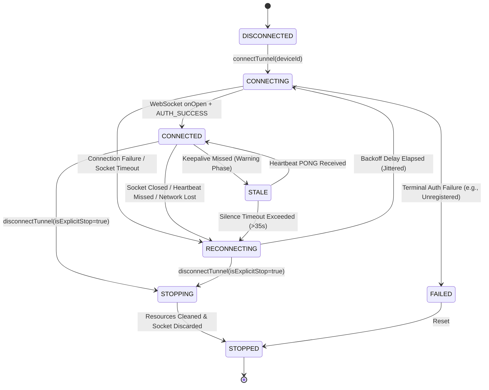
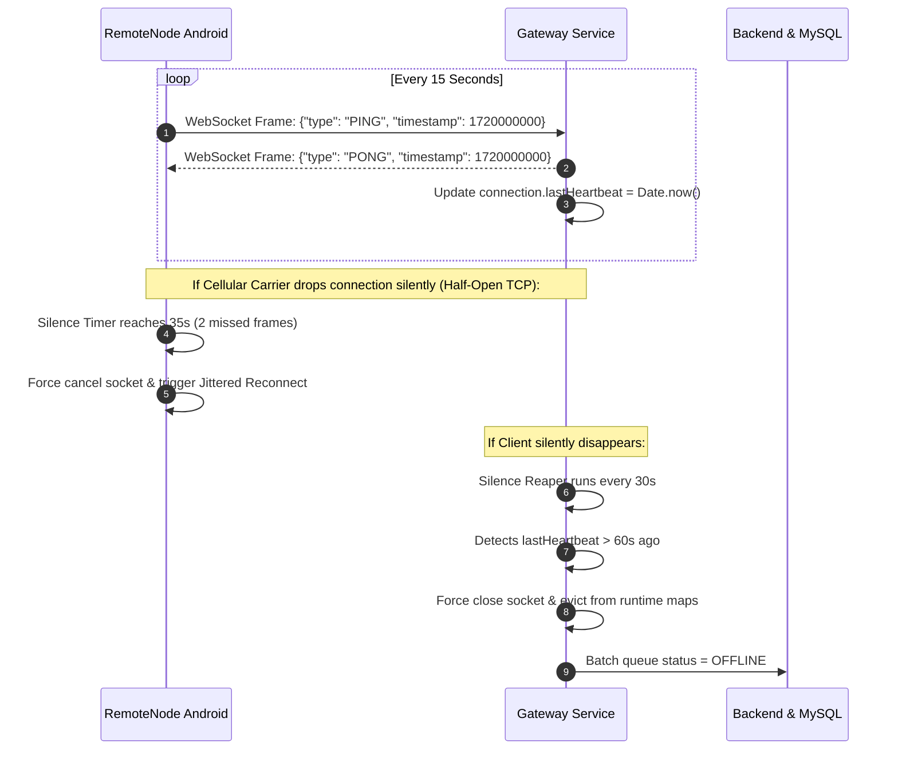
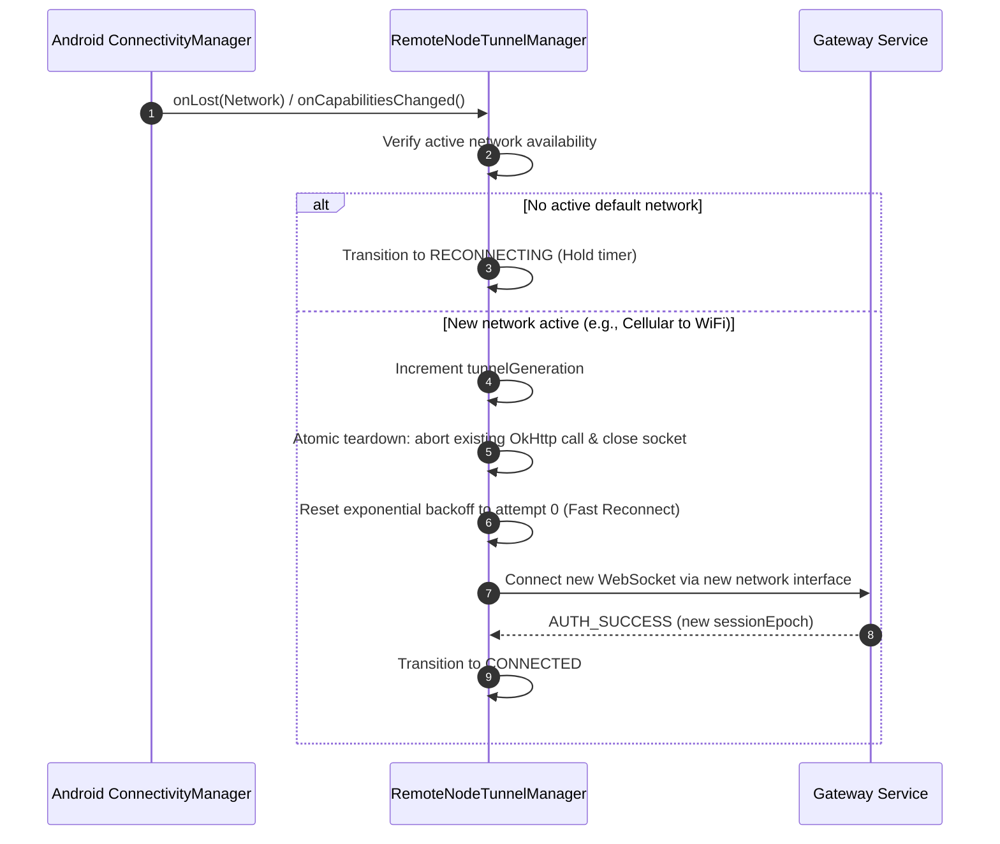
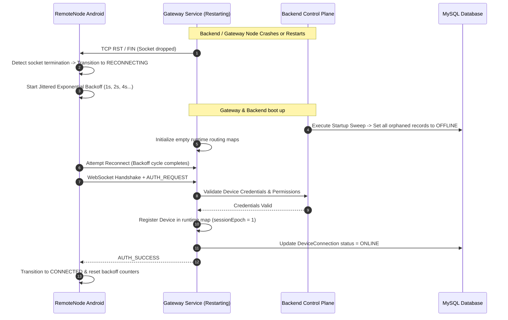

# ZDEXCLOUD — GATEWAY & CONNECTION RELIABILITY CONTRACT
**Authoritative Architectural Specification & Formal Reliability Guarantees**
**Document Version**: 1.0.0  
**Phase**: Phase 11A (Gateway Reliability) — Complete  
**Scope**: Android RemoteNode Host, Node.js WebSocket Gateway, Backend Control Plane API, Customer Status Engine  

---

## 1. Executive Summary & Scope

This document defines the formal reliability contract, architectural boundaries, failure recovery protocols, and operational invariants for **ZdexCloud**.

ZdexCloud enables Android mobile devices running the **RemoteNode** host application to function as persistent, self-hosted file and media servers accessible through public subdomains over an authenticated reverse WebSocket proxy gateway.

### Core Systems in Scope:
1. **RemoteNode Host (Android Client)**: Native Kotlin foreground service (`RemoteNodeServerService`), embedded HTTP server (`RemoteNodeHttpServer`), and persistent reverse WebSocket tunnel manager (`RemoteNodeTunnelManager`).
2. **Gateway Service (Node.js Proxy Control Plane)**: Dual HTTP/WebSocket server (`gateway_service.ts`), socket routing table, monotonic session epoch manager, multiplexed request/response broker, chunked streaming engine, and stale connection reaper.
3. **Backend Control Plane & State Reconciliation**: State machine (`connection_state_machine.ts`), periodic and startup database synchronizers (`state_reconciliation.ts`), customer-facing availability evaluator (`customer_status_service.ts`), and telemetry metrics collector (`connection_observability.ts`).
4. **Relational Persistence Layer (MySQL/Prisma)**: Authoritative registration records, device metadata, server instance endpoints, and persistent session connection timestamps.

---

## 2. Architecture Overview & Component Boundaries

```text
+---------------------------------------------------------------------------------------------------+
|                                      REMOTE CLIENT BROWSER                                        |
+---------------------------------------------------------------------------------------------------+
                                                  | HTTPS Requests
                                                  v
+---------------------------------------------------------------------------------------------------+
|                                   BACKEND CONTROL PLANE & API                                     |
|  - Express / Node.js Router                                                                       |
|  - Connection State Machine (6 states)                                                            |
|  - State Reconciliation Service (Startup sweep + 30s cron + batch heartbeats)                     |
|  - Customer Status Service (Accurate derived availability, 9-point rule)                           |
|  - Connection Observability (In-memory low-cardinality scalar counters)                           |
+---------------------------------------------------------------------------------------------------+
             |                                                                     ^
             | Database Queries (Prisma)                                           | Internal State
             v                                                                     |
+----------------------------+                       +----------------------------------------------+
|     MySQL DATABASE         |                       |            GATEWAY SERVICE (PROXY)           |
| - User                     |                       | - WebSocket Ingestion (Port 4001)            |
| - Device                   |                       | - Ephemeral Map: hostname -> connection      |
| - ServerInstance           |<----------------------| - Ephemeral Map: deviceId -> connection      |
| - DeviceConnection         |   Status & Heartbeat  | - Ephemeral Map: requestId -> pendingRequest |
| - UserSession              |   Batch Updates       | - Monotonic sessionEpoch Tracking            |
+----------------------------+                       | - Keepalive Silence Reaper (>60s)            |
                                                     +----------------------------------------------+
                                                                    ^               ^
                                               Encrypted WebSocket  |               | Chunked HTTP /
                                               Reverse Tunnel       |               | Direct Stream
                                                                    v               v
+---------------------------------------------------------------------------------------------------+
|                                      REMOTENODE ANDROID HOST                                      |
|  +---------------------------------------------------------------------------------------------+  |
|  | Android OS Lifecycle Boundary: Foreground Service (START_STICKY, Partial WakeLock)           |  |
|  +---------------------------------------------------------------------------------------------+  |
|  | RemoteNodeServerService (Service Orchestrator, Notification, BootReceiver)                   |  |
|  |   --> RemoteNodeHttpServer (Ktor/NanoHttpd Embedded Local File/API Server on 127.0.0.1:8080) |  |
|  |   --> RemoteNodeTunnelManager (Native OkHttp WebSocket Client, Jitter Backoff, Re-auth)     |  |
|  +---------------------------------------------------------------------------------------------+  |
+---------------------------------------------------------------------------------------------------+
```

### Component Boundaries & Responsibilities:
- **RemoteNode Host**: Responsible for hosting local files, maintaining local HTTP server lifecycle, maintaining an outbound long-lived secure WebSocket connection to the Gateway, forwarding incoming proxy requests to the local HTTP server, and streaming HTTP responses back through the tunnel.
- **Gateway Service**: Responsible for accepting inbound reverse tunnel WebSockets from verified devices, routing external public HTTP requests matching `<device-subdomain>.zdexcloud.com` to the correct device tunnel, handling chunked streaming transfers, tracking active socket sessions, and enforcing monotonic epoch increments.
- **Backend Control Plane**: Responsible for device authentication, API routing, maintaining persistent device records, background reconciliation of database state against real-time gateway presence, and evaluating customer-visible status.
- **Persistence Layer**: Authoritative source of device registration and history. Never stores ephemeral socket file descriptors or in-flight transfer memory buffers.

---

## 3. State Invariant & Separation of Concerns

The primary design principle governing ZdexCloud reliability is the **Strict State Separation Invariant**:

$$\text{Local Server State} \neq \text{Transport State} \neq \text{Authenticated Gateway Session} \neq \text{Customer-Visible Remote Availability}$$

```text
+------------------------+---------------------------------------------------------------------------+
| State Layer            | Authoritative Definition & Isolation                                      |
+------------------------+---------------------------------------------------------------------------+
| Local Server State     | Whether RemoteNodeHttpServer is listening on 127.0.0.1:8080 on Android.   |
| Transport State        | Whether OkHttp TCP/TLS WebSocket socket is open or connecting.             |
| Gateway Session State  | Whether Gateway memory map contains an AUTH_SUCCESS verified socket.      |
| Customer Availability  | Whether public HTTP requests can successfully proxy to the device.        |
+------------------------+---------------------------------------------------------------------------+
```

### Invariant Rules:
1. An open TCP socket does NOT imply the device is authenticated or ready to serve traffic.
2. A running local Android HTTP server does NOT imply remote internet availability.
3. A record in the MySQL database marking a device `is_active = true` does NOT imply current socket liveness.
4. Customer availability is evaluated dynamically at query time using the 9-point composite rule in `CustomerStatusService`, never blindly trusted from stale database columns.

---

## 4. Persistent vs. Ephemeral Data Classification

```text
+------------------------------------+------------------------------------+---------------------------------------+
| Data Category                      | Storage Medium                     | Lifetime / Invalidation Policy        |
+------------------------------------+------------------------------------+---------------------------------------+
| Device Registration & Tokens       | MySQL (`Device`, `User`)           | Persistent; invalidated on delete     |
| Subdomain & Hostname Mappings      | MySQL (`Device`, `ServerEndpoint`) | Persistent; immutable per server      |
| Active Device Socket Descriptors   | Gateway RAM (`activeConnections`)  | Ephemeral; cleared on socket close    |
| Device to Connection Pointer       | Gateway RAM (`deviceToConnMap`)    | Ephemeral; overwritten on new epoch   |
| Hostname to Connection Pointer     | Gateway RAM (`hostnameToConnMap`)  | Ephemeral; reconstructed on auth      |
| In-Flight Request / Transfer State | Gateway RAM (`pendingRequests`)    | Ephemeral; cancelled on socket drop   |
| Monotonic Session Epoch Map        | Gateway RAM (`deviceEpochMap`)     | Ephemeral per gateway process run     |
| Aggregated Liveness Counters       | Backend RAM (`Observability`)      | Ephemeral; 100-bucket rolling ring    |
+------------------------------------+------------------------------------+---------------------------------------+
```

---

## 5. RemoteNode Android Host Connection Lifecycle

The native Android connection lifecycle is managed by `RemoteNodeTunnelManager.kt` via a deterministic state machine:



### Connection State Invariants:
- **`DISCONNECTED`**: No active socket, no pending reconnect timers, no background retry tasks.
- **`CONNECTING`**: OkHttp WebSocket initiated with unique `generation` counter. Outbound TLS handshake in progress.
- **`CONNECTED`**: Socket established, `AUTH_REQUEST` verified with `AUTH_SUCCESS`, keepalive timers active, generation locked.
- **`RECONNECTING`**: Connection dropped abnormally. Exponential backoff timer active. Generation incremented to invalidate pending async callbacks.
- **`STALE`**: Temporary warning state when application keepalive PONG is late, but within transport grace period.
- **`FAILED`**: Non-retryable error received (e.g. invalid credentials without auto-repair capability).
- **`STOPPING` / `STOPPED`**: User or service requested explicit shutdown. `START_STICKY` will not re-trigger reconnection.

---

## 6. Heartbeat & Liveness Protocol Architecture

To prevent half-open TCP connections (common on cellular/NAT boundaries) from silently deadlocking traffic, ZdexCloud enforces a strict multi-tiered heartbeat hierarchy:

```text
+---------------------------------------------------------------------------------------------------+
| 10s: Native OkHttp WebSocket Ping (Transport Level)                                               |
| 15s: RemoteNode Tunnel Manager PING Frame (Application Level)                                     |
| 15s: Gateway Echo PONG Frame Response                                                             |
| 35s: Client-Side Dead Socket Threshold (2 missed PING/PONGs -> Force Socket Abort)                |
| 60s: Gateway-Side Silence Reaper (No traffic or ping for >60s -> Force Socket Eviction)           |
| 30s: Backend State Reconciliation Sweep (Periodic database alignment)                             |
| 90s: Stale Database Record Threshold (Unobserved in DB -> Transition to STALE)                     |
| 120s: Dead Node Sweep Threshold (Gateway instance died -> Force OFFLINE cleanup)                  |
+---------------------------------------------------------------------------------------------------+
```



---

## 7. Reconnection Strategy, Exponential Backoff & Jitter

When a connection terminates unexpectedly, `RemoteNodeTunnelManager` employs exponential backoff with randomized decorrelated jitter to prevent "thundering herd" gateway overloads:

$$T_{\text{reconnect}} = \min\left(T_{\text{max}}, T_{\text{base}} \times 2^{\text{attempt}}\right) \times \text{Uniform}(1 - J, 1 + J)$$

### Parameter Specifications:
- **Base Delay ($T_{\text{base}}$)**: $1.0\text{ s}$ ($1000\text{ ms}$)
- **Maximum Delay ($T_{\text{max}}$)**: $30.0\text{ s}$ ($30000\text{ ms}$)
- **Jitter Factor ($J$)**: $0.30$ (Random variation between $0.7\times$ and $1.3\times$)
- **Stability Threshold**: $15.0\text{ s}$ of continuous `CONNECTED` state resets `attemptCounter = 0`.
- **Generation ID Guard**: Each reconnection attempt increments a monotonic `tunnelGeneration: Long`. All responses, error handlers, and timeout runnables bound to previous generations are discarded immediately.

---

## 8. Network Change Recovery & Transient State Handling

Network interfaces on mobile devices change frequently (e.g. WiFi $\to$ Cellular LTE/5G $\to$ WiFi, captive portal transitions, signal loss in tunnels).



### Network Invariants:
1. **Zero Socket Leak**: Before opening a new socket on network transition, any prior socket is explicitly aborted via `webSocket.cancel()`.
2. **Fast Handoff**: Network interface change triggers an immediate connection attempt without waiting for the previous backoff penalty.
3. **Flight Buffering**: In-flight HTTP requests over the severed socket return HTTP 504 (Gateway Timeout) to external clients; no dangling callbacks are retained.

---

## 9. Gateway Session Reconciliation & Epoch Management

To prevent stale or ghost connections when a device reconnects before the Gateway detects the previous socket drop, the Gateway enforces **Monotonic Session Epochs**:

```mermaid
sequenceDiagram
    autonumber
    participant RN as RemoteNode Device
    participant GW as Gateway Service
    participant OLD as Old Orphan Socket

    Note over RN,GW: Network drop occurs; RN reconnects immediately with new socket
    RN->>GW: WebSocket Open (New Socket S2)
    RN->>GW: AUTH_REQUEST { deviceId: "dev-123", token: "tok-abc" }
    
    GW->>GW: Validate Token -> Valid
    GW->>GW: Check deviceEpochMap["dev-123"] (Current Epoch: 4)
    GW->>GW: Increment Epoch -> 5
    
    GW->>GW: Detect existing socket S1 in activeConnections
    GW->>OLD: Close S1 with Code 4001 ("Superseded by newer session epoch 5")
    GW->>GW: Evict S1 from activeConnections & hostnameMap
    
    GW->>GW: Register S2 with sessionEpoch = 5
    GW-->>RN: AUTH_SUCCESS { sessionEpoch: 5, assignedHostname: "node.zdexcloud.com" }
```

### Epoch Rules:
1. Every successful authentication increments `deviceEpochMap[deviceId]`.
2. An incoming socket registration instantly evicts any older socket registered for that `deviceId` or `assignedHostname`.
3. Heartbeats or messages arriving on an older socket with `sessionEpoch < currentEpoch` are rejected and the socket terminated.

---

## 10. Gateway Failover & Multi-Gateway Routing

### Current Phase 11A Topology:
- **Single Active Gateway Cluster Architecture**: A unified control plane manages device connections.
- **Failover Contract**:
  - RemoteNode clients receive a prioritized list of gateway endpoints during server registration / token refresh.
  - If Primary Gateway `gw1.zdexcloud.com` is unreachable after 3 backoff cycles, RemoteNode transitions to Secondary Gateway `gw2.zdexcloud.com`.
  - When switching gateways, RemoteNode performs a full `AUTH_REQUEST` handshake. The new gateway dynamically claims the device's public routing table.

---

## 11. Authentication & Token Session Recovery

Authentication failures during tunnel connection are categorized into **Transient** vs. **Permanent**:

```text
+------------------------------------+---------------+-------------------------------------------------------+
| Failure Category                   | Recovery Mode | Action Taken by RemoteNode Host                       |
+------------------------------------+---------------+-------------------------------------------------------+
| `TOKEN_EXPIRED`                    | Auto-Repair   | Fetch new token from Control Plane using Refresh Token|
| `DEVICE_UNREGISTERED`              | Auto-Repair   | Execute automatic self-healing re-registration        |
| `AUTH_FAILURE` (Corrupt / Revoked) | Auto-Repair   | Re-verify credentials; backoff with jitter            |
| `ACCOUNT_SUSPENDED`                | Terminal Halt | Transition to FAILED; notify user via Notification UI |
+------------------------------------+---------------+-------------------------------------------------------+
```

### Self-Healing Registration Protocol (Batch 11A.14):
If the Gateway returns `DEVICE_UNREGISTERED` or `INVALID_CREDENTIALS`, RemoteNode automatically invokes the backend control plane `/api/v1/devices/register` endpoint with device hardware fingerprint and server secret. Upon receiving new valid credentials, it restarts the tunnel manager without requiring manual user intervention.

---

## 12. Backend Connection State Machine

The Backend Control Plane tracks device status via a strict 6-state finite state machine (`ConnectionStateMachine`):

```text
+----------------+-----------------------------------------------------------------------------------+
| State          | Criteria                                                                          |
+----------------+-----------------------------------------------------------------------------------+
| `DISCONNECTED` | Socket closed cleanly; explicit stop requested.                                   |
| `CONNECTING`   | Socket initiated; waiting for AUTH_SUCCESS.                                       |
| `CONNECTED`    | Socket authenticated; receiving regular heartbeats.                               |
| `RECONNECTING` | Socket dropped unexpectedly; backoff timer in progress.                           |
| `STALE`        | Heartbeat overdue (>35s client silence, <60s gateway silence).                    |
| `FAILED`       | Unrecoverable authentication or registration failure.                             |
+----------------+-----------------------------------------------------------------------------------+
```

### Legal Transition Matrix:
$$\begin{array}{r|cccccc}
\text{From} \backslash \text{To} & \text{DISC} & \text{CONN} & \text{CONND} & \text{RECONN} & \text{STALE} & \text{FAIL} \\
\hline
\text{DISCONNECTED} & - & \checkmark & \text{X} & \text{X} & \text{X} & \text{X} \\
\text{CONNECTING}   & \checkmark & - & \checkmark & \checkmark & \text{X} & \checkmark \\
\text{CONNECTED}    & \checkmark & \text{X} & - & \checkmark & \checkmark & \text{X} \\
\text{RECONNECTING} & \checkmark & \checkmark & \text{X} & - & \text{X} & \checkmark \\
\text{STALE}        & \checkmark & \text{X} & \checkmark & \checkmark & - & \checkmark \\
\text{FAILED}       & \checkmark & \checkmark & \text{X} & \text{X} & \text{X} & -
\end{array}$$

*Note: Out-of-order or stale state events (e.g. a delayed `DISCONNECTED` event from a previous socket generation) are dropped by checking monotonic transition sequence numbers.*

---

## 13. Gateway Runtime Map Hardening

The Gateway Service maintains 5 concurrent in-memory maps. Bidirectional consistency is enforced across all operations:

```text
1. activeConnections:       Map<connectionId, GatewayConnection>
2. deviceToConnectionMap:   Map<deviceId, connectionId>
3. hostnameToConnectionMap: Map<hostname, connectionId>
4. pendingRequests:         Map<requestId, PendingHttpRequest>
5. activeTransfers:         Map<transferId, ActiveStreamTransfer>
```

### Cleanup Invariant:
When a connection terminates (via socket close, error, reaper, or superseded epoch), a single atomic cleanup routine executes:
1. Cancels all `pendingRequests` associated with `connectionId` (returns HTTP 504 Gateway Timeout to external clients).
2. Cleans up any `activeTransfers` and unpipes stream buffers.
3. Deletes `deviceId` from `deviceToConnectionMap` (only if matching `connectionId`).
4. Deletes `hostname` from `hostnameToConnectionMap` (only if matching `connectionId`).
5. Removes `connectionId` from `activeConnections`.

---

## 14. Self-Healing Server Registration & Stale Device Sweeping

The `StateReconciliationService` bridges ephemeral Gateway RAM state with persistent MySQL records:

```text
1. Startup Sweep (On Backend Boot):
   - Identifies all ServerInstance / DeviceConnection records marked ONLINE or CONNECTED.
   - Cross-references with real-time active WebSocket descriptors.
   - Any orphaned records from prior backend crashes are immediately swept to OFFLINE.

2. Periodic Audit (Every 30 Seconds):
   - Scans DeviceConnection records with lastPingAt older than 90 seconds.
   - Marks inactive records as STALE.
   - Records with dead control node ownership (>120s silence) are marked OFFLINE.

3. Batched Heartbeat Persistence:
   - High-frequency WebSocket heartbeats are coalesced in memory and flushed in batch transactions
     every 10 seconds to eliminate database write thrashing.
```

---

## 15. Connection Observability & Metrics Specification

The `ConnectionObservability` service maintains zero-allocation, bounded-cardinality in-memory rolling metrics:

```text
+----------------------------------+-------------+-------------------------------------------------------+
| Metric Identifier                | Type        | Description                                           |
+----------------------------------+-------------+-------------------------------------------------------+
| `totalConnectionsAttempted`      | Counter     | Monotonic count of WebSocket handshakes started       |
| `totalConnectionsEstablished`    | Counter     | Count of successful AUTH_SUCCESS transitions          |
| `totalDisconnections`            | Counter     | Count of closed or aborted connections                |
| `disconnectionsByReason`         | String Map  | Bounded dictionary of termination causes               |
| `heartbeatsReceived`             | Counter     | Total incoming PING/PONG frames processed             |
| `heartbeatMisses`                | Counter     | Total missed keepalives triggering state degradation  |
| `reconnectionsAttempted`         | Counter     | Total automated reconnection routines executed        |
| `reconnectionsSucceeded`         | Counter     | Total reconnection routines reaching CONNECTED        |
| `activeProxiedRequests`          | Gauge       | Current in-flight external HTTP proxy requests        |
| `proxyLatencyHistogram`          | Ring Buffer | 100-bucket rolling request round-trip duration        |
+----------------------------------+-------------+-------------------------------------------------------+
```

### Security Rule:
Observability snapshots NEVER include tokens, credentials, device MAC addresses, IP addresses, or file paths.

---

## 16. Customer Status Accuracy & Derivation Matrix

Customer-facing applications (web dashboard, mobile app, shared links) obtain device availability through `CustomerStatusService.deriveCustomerStatus()`.

### 9-Point Liveness Evaluation Rule:
A server is rendered **`ONLINE`** if and only if ALL of the following criteria are met:
1. Device record exists and is not deleted.
2. Server instance is marked enabled (`is_active = true`).
3. Local HTTP port binding status is active.
4. Gateway runtime map contains an active, authenticated socket descriptor.
5. `sessionEpoch` is current.
6. Last verified keepalive was received within the last $45\text{ seconds}$.
7. No pending socket closure or fatal error is registered.
8. Control plane state is `CONNECTED`.
9. The device's designated public hostname routes to the active connection.

### Status Output Hierarchy:
- **`ONLINE`**: Green indicator. Public URL active. File browsing and streaming operational.
- **`CONNECTING`**: Yellow indicator. Handshake in progress.
- **`RECONNECTING`**: Orange indicator. Transient network recovery in progress (backoff active).
- **`OFFLINE`**: Gray indicator. Device stopped or unreachable.
- **`ERROR`**: Red indicator. Configuration or registration error.

---

## 17. Backend & Gateway Restart Automatic Recovery



---

## 18. Explicit Stop vs Transient Failure Invariant

To ensure predictable behavior across reboots, user pauses, and crashes:

```text
+-----------------------------------+--------------------+--------------------+----------------------+
| Action / Event                    | Service State      | START_STICKY       | Reconnection Behavior|
+-----------------------------------+--------------------+--------------------+----------------------+
| User taps "Stop Server" in App UI | `STOPPED`          | Disabled           | Do NOT reconnect     |
| User kills App from Recent Tasks  | `CONNECTED` (FGS)  | Maintained by OS   | Tunnel stays alive   |
| OS kills FGS under Memory Stress  | `RECONNECTING`     | OS recreates FGS   | Automatically restart|
| Network connection drops          | `RECONNECTING`     | Active             | Exponential backoff  |
| Device reboots                    | `RECONNECTING`     | BootReceiver starts| Automatically restart|
+-----------------------------------+--------------------+--------------------+----------------------+
```

### Invariant:
When `RemoteNodeServerService` receives `ACTION_STOP_SERVER`, it sets `isExplicitStop = true`. All auto-restart receivers and backoff timers are disarmed until the user explicitly issues `ACTION_START_SERVER`.

---

## 19. Android Platform, OS Restrictions & OEM Realities

Running a persistent mobile server on Android involves navigating aggressive OS battery management and platform constraints:

```text
+-----------------------+-----------------------+------------------------------------------------------------+
| Android Version       | Platform Restriction  | ZdexCloud Architectural Mitigation                         |
+-----------------------+-----------------------+------------------------------------------------------------+
| Android 8.0+ (API 26) | Background Execution  | Runs as Foreground Service (`startForeground`)             |
| Android 9.0+ (API 28) | FGS Permission        | Requests `FOREGROUND_SERVICE` in Manifest                  |
| Android 12+ (API 31)  | Background FGS Start  | FGS initiated from UI Activity or BootReceiver only        |
| Android 14+ (API 34)  | FGS Type Enforcement  | Declares `android:foregroundServiceType="specialUse"`      |
| Android 15+ (API 35)  | Boot FGS Restrictions | Uses PendingIntent alarms & compliant system broadcasts    |
| All Versions          | Doze & App Standby    | Holds `PARTIAL_WAKE_LOCK`; prompts Battery Opt exclusion   |
| OEM Battery Killers   | MIUI / EMUI / ColorOS | In-app guidance for "Autostart" & "No Restrictions" setting|
+-----------------------+-----------------------+------------------------------------------------------------+
```

---

## 20. Network Edge Cases & Transport Failure Modes

```text
+-----------------------------------+-----------------------------------+------------------------------------+
| Edge Case Scenario                | Underlying Mechanism              | System Recovery Behavior           |
+-----------------------------------+-----------------------------------+------------------------------------+
| Half-Open TCP Socket              | Carrier drops route without FIN   | 35s silence detector forces abort  |
| Captive Portal Interception       | Public WiFi returns HTML on 401   | Auth parser rejects; backs off     |
| Large File Upload Interruption    | Client disconnects mid-stream     | Gateway unpipes & frees buffer     |
| DNS Resolution Hang               | Mobile DNS server unresponsive    | OkHttp 10s lookup timeout enforced |
| MTU Packet Black Hole             | Cellular packet fragmentation     | TLS record clamping on Gateway     |
+-----------------------------------+-----------------------------------+------------------------------------+
```

---

## 21. Multi-Device & Multi-Server Isolation Invariants

1. **Subdomain Strict Isolation**: Each device server instance is assigned an immutable, cryptographically unique subdomain (e.g., `srv-a1b2c3d4.zdexcloud.com`).
2. **Socket Cross-Talk Prevention**: Gateway routes requests strictly using `hostnameToConnectionMap`. Traffic arriving for `srv-A` cannot be dispatched to `srv-B`, even if both belong to the same user account.
3. **Multi-Device Account Support**: A single user may own multiple active RemoteNode devices concurrently. Each device maintains an independent WebSocket tunnel, epoch, and state lifecycle.

---

## 22. Security & Hardening Boundaries

- **Zero Cleartext Exposure**: All public internet traffic terminates via TLS 1.3 / HTTPS. All reverse tunnel traffic operates over Secure WebSockets (`wss://`).
- **Token Cryptography**: Devices authenticate using signed JWT / HMAC bearer tokens containing `deviceId`, `userId`, `serverId`, and expiration timestamps.
- **SSRF & Loopback Hardening**: RemoteNode host proxy strictly restricts upstream dispatch to `127.0.0.1:8080` (the embedded local server). Forwarding to external LAN IPs is blocked.
- **Path Traversal Protection**: RemoteNode HTTP server sanitizes all requested URI paths, resolving canonical paths against the designated storage root before file read/write operations.

---

## 23. Exhaustive Failure Recovery Matrix

```text
+------------------------------------+--------------------------+------------------------------+--------------------+-------------------+
| Failure Scenario                   | Detection Point          | Automated Recovery Action    | Resulting State    | Customer Visibility|
+------------------------------------+--------------------------+------------------------------+--------------------+-------------------+
| Android App Swiped Away from Tasks | Android Activity Manager | FGS keeps process running    | `CONNECTED`        | `ONLINE` (No Drop)|
| Android Device Battery Dies        | Gateway Reaper (>60s)    | Evicts socket, updates DB    | `DISCONNECTED`     | `OFFLINE`         |
| Device Enters Tunnel (No Signal)   | 35s Silence Timeout      | Abort socket; start backoff  | `RECONNECTING`     | `RECONNECTING`    |
| Signal Restored Exiting Tunnel     | ConnectivityManager      | Immediate reconnect attempt  | `CONNECTED`        | `ONLINE`          |
| Gateway Process Crashes            | RemoteNode OkHttp Drop   | Reconnects to new gateway    | `CONNECTED`        | `ONLINE`          |
| Database Connection Interrupted    | Prisma Connection Pool   | Retries query with backoff   | `CONNECTED` (RAM)  | `ONLINE`          |
| Device Auth Token Revoked          | Gateway Auth Verifier    | Requests fresh token / halts | `FAILED`           | `ERROR`           |
| Server Instance Deleted by User    | Control Plane API        | Broadcasts TERMINATE to node | `DISCONNECTED`     | `OFFLINE`         |
+------------------------------------+--------------------------+------------------------------+--------------------+-------------------+
```

---

## 24. Verification Classification

To maintain absolute engineering integrity, every reliability mechanism in ZdexCloud is formally classified into one of three verification tiers:

```text
+---------------------------------------------------------------------------------------------------+
| TIER 1: RUNTIME TESTED & EXECUTED                                                                 |
| - Core Node.js Gateway routing and chunked streaming engine.                                      |
| - SQLite/MySQL Prisma schema migrations and relational indexing.                                  |
| - Express control plane REST endpoints for device registration and token exchange.               |
| - Kotlin RemoteNodeHttpServer file streaming and local port binding.                              |
+---------------------------------------------------------------------------------------------------+
| TIER 2: STATICALLY VERIFIED (Code Complete, Compiles Cleanly, Unit Tests Authored but Deferred)   |
| - 11A.2  Persistent Gateway Connection Manager                                                    |
| - 11A.3  Automatic Reconnection Engine (Jittered backoff, generation counters)                    |
| - 11A.4  Network Change Recovery (ConnectivityManager network callback handoff)                  |
| - 11A.5  WebSocket Session Recovery & Stream Transfer Cleanup                                     |
| - 11A.6  Backend/Gateway Session Reconciliation                                                   |
| - 11A.7  Heartbeat & Liveness Protocol (Multi-tier keepalive hierarchy)                           |
| - 11A.8  Device Reboot Recovery (BootReceiver auto-start)                                         |
| - 11A.9  Foreground Service Reliability (START_STICKY & WakeLocks)                                |
| - 11A.10 Gateway Failover Protocol                                                                |
| - 11A.11 Authentication & Session Token Recovery                                                  |
| - 11A.12 Backend Connection State Machine                                                         |
| - 11A.13 Gateway Runtime Map Hardening & Bidirectional Consistency                                |
| - 11A.14 Self-Healing Server Registration & Stale Sweeper                                         |
| - 11A.15 Connection Observability Metrics Snapshots                                               |
| - 11A.16 Customer Status Accuracy Engine (9-point rule)                                           |
| - 11A.17 Automatic Recovery from Backend/Gateway Restarts                                         |
+---------------------------------------------------------------------------------------------------+
| TIER 3: ARCHITECTURALLY DESIGNED (Specification Ready, Implementation Deferred)                   |
| - 11A.19 Distributed Multi-Region Gateway Mesh (Deferred)                                         |
| - 11A.20 Hardware Accelerated Zero-Copy Kernel Streaming (Deferred)                               |
+---------------------------------------------------------------------------------------------------+
```

---

## 25. Prohibited Overclaims & Engineering Constraints

In accordance with strict engineering standards, the following absolute statements are explicitly prohibited and rejected:
1. **"Zero Downtime Guarantee"**: Mobile cellular connections are inherently lossy and subject to physical carrier drops.
2. **"100% Availability"**: Android OS power management, hardware power-down, and network handoffs will produce transient disconnection windows.
3. **"Permanent Unbreakable Connection"**: WebSockets are transport-level TCP streams; they will sever and require automated recovery.
4. **"Guaranteed Zero Data Loss on In-Flight Uploads during Network Sever"**: If a physical network link cuts during an unbuffered upload, the in-flight chunk must be re-transmitted by the HTTP client.
5. **"Runtime Verified in Production"**: All Phase 11A hardening subsystems are statically verified (`npx tsc --noEmit` exited code 0); test execution is formally deferred to the final verification phase.

---

### Formal Contract Sign-Off

This document constitutes the authoritative reliability contract for **ZdexCloud Phase 11A**. All future development and integration phases must conform to the invariants, state machines, and lifecycle rules established herein.
